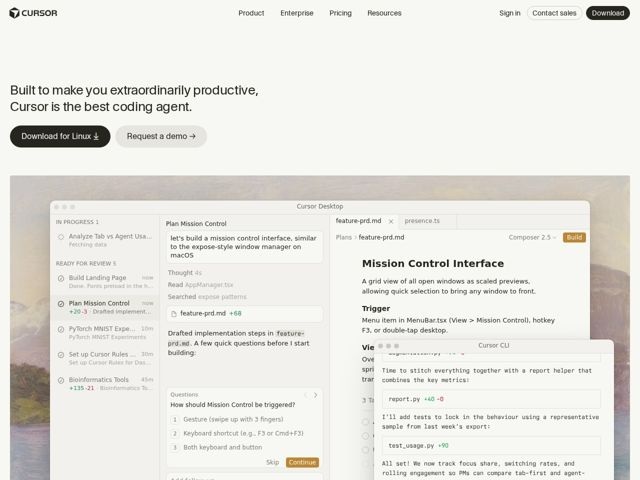

# Cursor — https://cursor.com

- **niche:** dev-tools
- **mood:** clean-light
- **style:** minimal, photographic, mono-type
- **palette:** bg `#FBFAF8` · ink `#0A0A0A` · accent `#E8643C` — tiny 'Build' badge, 'Continue' CTA button, and diff +/- counts inside the product screenshot — never on the primary page chrome
- **type:** display *Geometric/grotesque sans (custom Cursor type, near-Inter/SF in feel)* · body *Same neutral sans for marketing copy; monospace for all in-app code, filenames, and CLI output* — Quiet, almost OS-native — a tool that looks like the system it lives in, not a brand shouting at you
- **sections:** hero › product-screenshot › logos › feature-agents › feature-autonomous › feature-integrations › feature-autocomplete › feature-models › feature-codebase › how-it-works › changelog › cta › footer
- **signature:** The hero's product shot is not a slick marketing mockup — it's a fully live, dense IDE screenshot (real task queue, real chat thread mid-conversation, real CLI diffs) framed in a macOS window whose rounded corners reveal a classical oil-painting landscape behind it. A dev tool literally showing itself doing the boring real work, with a fine-art texture as the backdrop — the opposite of the usual gradient-glow abstraction.
- **imagery:** One hero-dominating, hyper-detailed screenshot of the actual application (file tree, agent task list with status pills, multi-pane chat, monospace terminal diffs). No icons, no 3D, no illustration. The only non-UI image is a muted painterly landscape used as ambient wallpaper bleeding from behind the app window, giving warmth to an otherwise sterile light canvas.
- **copy:** Plain-spoken superlative claim, lowercase confidence — hero reads "Built to make you extraordinarily productive, Cursor is the best coding agent."

**Takeaways (steal as ideas, don't copy):**
- Sell with a real, intimidatingly dense product screenshot instead of a sanitized mockup — show the tool mid-task (queued jobs, live chat, actual diffs) to signal it genuinely works.
- Hide ALL color in the product UI, not the page chrome: a single warm orange survives only on micro-elements (Build badge, Continue button, +/- counts) so the eye lands exactly where action happens.
- Bleed a soft painterly/fine-art texture from behind the app window to warm up a clean-light dev page without resorting to gradients or glow.
- Localize the CTA to the visitor's OS ('Download for Linux') — a small detail that makes the page feel built for the exact person reading it.
