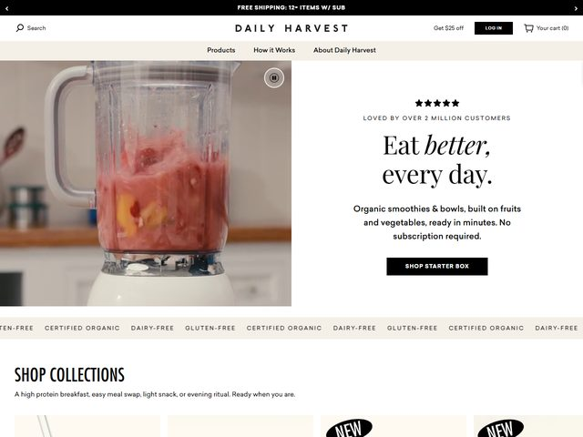

# Daily Harvest — https://www.daily-harvest.com

- **niche:** food
- **mood:** clean-light
- **style:** editorial, photographic, minimal, warm-neutral
- **palette:** bg `#F2EFE9` · ink `#1C1A17` · accent `#000000` — Não há cor de marketing alguma: o único "acento" é preto puro, usado no botão sólido `SHOP STARTER BOX`, na pílula `LOG IN` e na fina barra de promoção no topo. A cor vem inteiramente da foto de comida (o smoothie rosa), não da UI.
- **type:** display *serif editorial de alto contraste com itálico swash (sensação de Canela / Ogg / Tiempos Headline)* · body *sans humanista pequeno (Founders Grotesk / Neue Haas)* — Pose de capa de revista; o serif faz toda a fala, o sans só rotula.
- **sections:** hero › shop-collections › how-it-works › ingredients-quality › reviews/social-proof › cta › footer
- **signature:** O título mistura romano e itálico dentro de uma só frase — "Eat *better,* every day." — com "better" em itálico serifado ondulante, de modo que uma única palavra carrega todo o calor. Fica alinhado à direita ao lado de uma foto quase full-bleed de um liquidificador no meio do despejo (smoothie rosa, bokeh suave de cozinha), e a composição inteira é dividida bem ao meio: foto editorial à esquerda, coluna de texto centralizada à direita sobre creme caloroso. Uma fileira de 5 estrelas mais o eyebrow "LOVED BY OVER 2 MILLION CUSTOMERS" faz o trabalho de confiança acima do título.
- **imagery:** Fotográfica, naturalista, lifestyle. Um liquidificador real de smoothie de morango-pêssego fotografado numa cozinha doméstica de luz quente com profundidade de campo rasa — sem 3D, sem ilustração, sem render de produto. Há um pequeno controle circular de pausa/play sobreposto à imagem, sugerindo que a hero é um vídeo em loop, não uma foto estática.
- **copy:** Calorosa, imperativa, direta. Título "Eat *better,* every day."; eyebrow "LOVED BY OVER 2 MILLION CUSTOMERS"; subhead "Organic smoothies & bowls, built on fruits and vegetables, ready in minutes. No subscription required." Uma marquee rolante de credenciais ("GLUTEN-FREE · CERTIFIED ORGANIC · DAIRY-FREE") corre abaixo da dobra, e a seção seguinte abre com "SHOP COLLECTIONS / A high protein breakfast, easy meal swap, light snack, or evening ritual. Ready when you are."

**Takeaways (roube como ideias, não copie):**
- Coloque em itálico UMA palavra dentro de um título serifado de resto romano para injetar voz sem um segundo tipo ou qualquer cor.
- Vá totalmente sem cor na UI (preto + creme apenas) e deixe uma única foto apetitosa de comida ser a única fonte de saturação.
- Faça da hero um vídeo silencioso em loop do produto em movimento (um despejo, uma mexida) com um minúsculo controle de pausa, não uma foto congelada.
- Empilhe a confiança acima do título: fileira de estrelas + eyebrow "loved by 2M customers" antes de a marca sequer fazer sua oferta.
- Rode uma marquee de rolagem infinita de certificações ("certified organic", "dairy-free") como uma faixa de credibilidade discreta e repetitiva entre a hero e as coleções.
