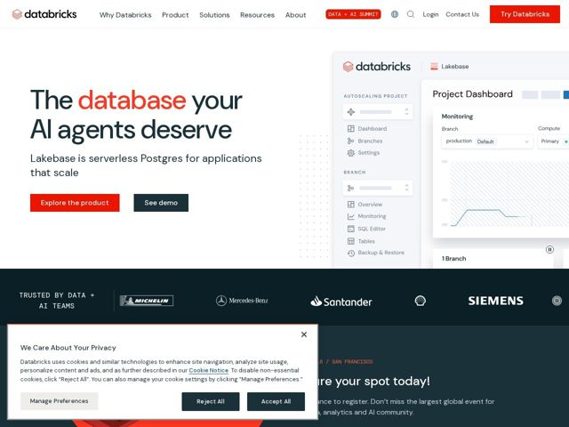

# Databricks — https://databricks.com

- **niche:** data-ai
- **mood:** clean-light
- **style:** minimal, mono-type, illustrated
- **palette:** bg `#FFFFFF` · ink `#1B3139` · accent `#FF3621` — logo mark, the highlighted word 'database' in the hero headline, primary 'Try Databricks' / 'Explore the product' CTA buttons
- **type:** display *DM Sans* · body *DM Sans / Inter* — Geometric humanist sans with a tight, confident hero set; DM Mono used for small-caps eyebrow labels ('AUTOSCALING PROJECT', 'TRUSTED BY DATA + AI TEAMS') gives an engineering, terminal-adjacent texture against the soft sans body
- **sections:** hero › logos › feature-platform › feature-lakebase › feature-agents › feature-analytics › feature-governance › feature-warehouse › feature-pipelines › testimonials › awards › cta › footer
- **signature:** A near-photoreal product UI replica sits in the hero instead of an abstract gradient or hero photo: a fully-rendered "Project Dashboard" mock (branches, monitoring chart, SQL editor nav) that literally shows the Postgres-style app the copy promises, turning the visual into proof rather than decoration.
- **imagery:** Flat, high-fidelity product-UI mockups rendered as clean cropped panels bleeding off the right edge; monochrome customer wordmark logos (Michelin, Mercedes-Benz, Santander, Siemens) on a single trust row; subtle dotted-grid texture connecting hero text to the UI panel. No photography of people, no 3D, no stock.
- **copy:** Provocative, anthropomorphic product claim that flatters the buyer's ambition; hero reads "The database your AI agents deserve" with subhead "Lakebase is serverless Postgres for applications that scale."

**Takeaways (steal as ideas, don't copy):**
- Color-isolate ONE word in a long black headline (here 'database' in brand red) to carry the entire brand accent and the message in one move.
- Pair a soft geometric sans body with a mono-spaced small-caps eyebrow label to signal 'engineering credibility' without going fully dark/technical.
- Let the hero product mock bleed off the right edge and crop it mid-component, so it reads as a real live app window rather than a centered marketing illustration.
- Use a desaturated single-row logo wall right under the fold with a mono 'TRUSTED BY' label to anchor enterprise trust before any feature copy.
