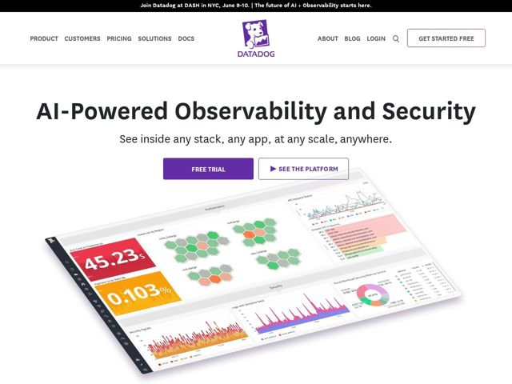

# Datadoghq — https://datadoghq.com

- **niche:** observability / devops monitoring
- **mood:** clean-light
- **style:** minimal, photographic, colorful
- **palette:** bg `#FFFFFF` · ink `#2E2E3A` · accent `#632CA6` — o roxo da Datadog no logo, o preenchimento do botão primário 'Free Trial', texto de link/CTA e os tons dos gráficos do dashboard
- **type:** display *Sans geométrico humanista (sans de marca da Datadog, tipo Gotham/Proxima)* · body *Mesma família em peso mais leve para o subhead* — Amigável-corporativa: formas de letra arredondadas e acessíveis que suavizam um produto de infra de resto enterprise
- **sections:** announcement-bar › nav › hero › feature-cloud-migration (AWS/Azure/GCP) › analyst-recognition (Forrester/Gartner) › feature-platform › products › footer
- **signature:** A 'imagery' da hero é uma única captura de tela enorme, inclinada em perspectiva, do dashboard real ao vivo — repleta de clusters hexbin reais, tiles de métrica em vermelho/laranja/roxo e gráficos densos — usada como a foto-vitrine do produto em vez de uma ilustração abstrata. O produto literalmente É o visual.
- **imagery:** UI de produto fotorrealista: um dashboard sem laptop, inclinado em 3/4 isométrico, flutuando para fora da borda da página, tiles de KPI numéricos em tamanho descomunal (45.23s em vermelho, 0.103% em âmbar), mapas de hosts em favo de mel e séries temporais coloridas. Densidade de dados maximalista renderizada como a arte da hero.
- **copy:** Reivindicação de capacidade direta com uma promessa confiante — H1 'AI-Powered Observability and Security' sobre subhead 'See inside any stack, any app, at any scale, anywhere.'

**Takeaways (roube como ideias, não copie):**
- Use seu dashboard real e movimentado como a hero — incline-o em perspectiva e deixe-o vazar além da borda da tela para que a densidade leia como capacidade, não bagunça
- Combine um H1 cheio de buzzword ('AI-Powered Observability') com um subhead rítmico e anafórico ('any stack, any app, any scale, anywhere') para fazer a promessa grudar
- Apoie-se em tiles de KPI ao vivo em tamanho descomunal, em vermelho/âmbar saturados, como âncoras focais dentro de um layout de resto branco e contido
- CTA em dois níveis: um 'Free Trial' roxo sólido ao lado de um 'See the Platform' fantasma com um triângulo de play — compromisso vs. exploração numa só fileira
