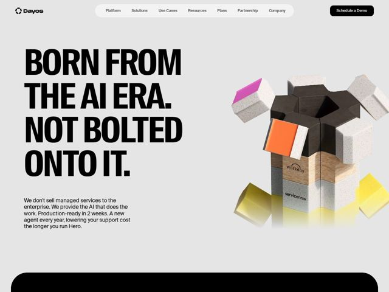

# Dayos — https://dayos.com

- **niche:** ai
- **mood:** bold-loud
- **style:** 3d, colorful, mono-type
- **palette:** bg `#E4E4E2` · ink `#0A0A0A` · accent `#E84BC9` — Bursts of saturated color (magenta, orange, yellow) live only inside the 3D hero sculpture's exploded cube faces; the rest of the UI stays grayscale — black ink on light-gray, black CTA pill
- **type:** display *Helvetica Now / Neue Haas Grotesk-style grotesque (heavy weight, tight tracking, all-caps)* · body *Same grotesque family at regular weight* — Mono-type Swiss brutalism — one neutral grotesque doing everything from a wall-sized black headline to small print; confident, industrial, no decoration
- **sections:** hero › problem › feature-intro-hero › feature-erp-hcm › use-case-library › feature-back-office › cta › footer
- **signature:** The hero visual is a single photoreal 3D totem built from interlocking gear-shaped slabs — wood, concrete, and brightly painted cubes — physically "exploding" outward, with embossed competitor logos (Workday, ServiceNow) baked into the stone layers. It literalizes "born from the AI era, not bolted on" as a material object rather than a UI screenshot.
- **imagery:** Abstract-3d product metaphor: tactile CGI sculpture with real-world materials (rough concrete speckle, raw wood grain, glossy painted cubes) and soft studio shadows. Only the 3D object carries color and texture; everything around it is flat, near-empty negative space. No app screenshots in view.
- **copy:** Defiant manifesto voice — short declarative slabs that pick a fight with incumbents. Hero: "BORN FROM THE AI ERA. NOT BOLTED ONTO IT." Subhead doubles down: "We don't sell managed services to the enterprise. We provide the AI that does the work."

**Takeaways (steal as ideas, don't copy):**
- Let ONE oversized all-caps grotesque headline occupy ~40% of the viewport height as the entire left column, with the visual pinned right — the type IS the hero art, no graphic flourish needed.
- Quarantine color: keep the whole page grayscale and let saturated hues (magenta/orange/yellow) appear ONLY inside the 3D object, so the visual reads as the single source of energy on the page.
- Build the hero metaphor as a physical 3D material study (stone, wood, painted blocks) instead of a dashboard mockup — and emboss rival brand names into it to stake a competitive claim non-verbally.
- Write headlines as a two-part diss/manifesto ('X. Not Y.') that names the old way and rejects it, so the positioning lands before any feature copy is read.
