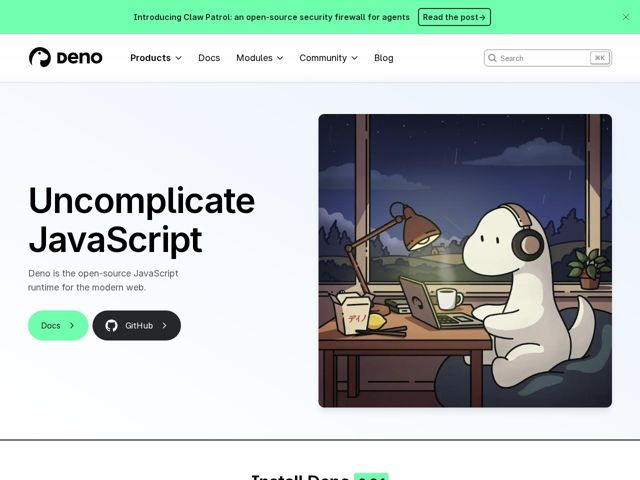

# Deno — https://deno.com

- **niche:** dev-tools
- **mood:** clean-light
- **style:** minimal, illustrated, gradient
- **palette:** bg `#EEF2FB` · ink `#0D0D0D` · accent `#70FFAF` — preenchimento da barra de anúncio, botão primário em pílula 'Docs', destaque inline atrás do número da versão e pequenos acentos de UI
- **type:** display *Inter (peso heavy/bold, tracking apertado)* · body *Inter (regular)* — Grotesque projetado e neutro, mas o peso de display bold e massivo o faz parecer confiante e quase editorial em vez de estéril
- **sections:** announcement-bar › nav › hero › install/how-it-works › feature-built-in-tools › feature-web-standards › feature-batteries-included › feature-secure-by-default › feature-built-for-cloud › feature-cloud-platform › feature-fresh-framework › cta › footer
- **signature:** Um mascote dinossauro desenhado à mão, em estilo lo-fi-anime, num quarto aconchegante à noite (fones de ouvido, abajur de mesa, comida pra viagem, ramen com カナ japonês na caixa) ancora a hero — trocando a habitual grade/terminal/captura-de-código de ferramenta de dev por uma cena ilustrada, emocional e narrativa que irradia calma em vez de intensidade técnica.
- **imagery:** Ilustração sob medida em vez de foto ou capturas de tela: uma cena calorosa e pictórica de anime/próxima de Ghibli com gradientes suaves, bordas arredondadas e um personagem amigável. As imagens definem clima (aconchego, foco, programação madrugada adentro) em vez de explicar o produto. Combinada com um fundo de lavagem azul-pálido para branco que mantém o resto da página arejado.
- **copy:** Imperativo confiante, começando pelo verbo, que reenquadra a categoria — a hero diz "Uncomplicate JavaScript", o subhead a aterrissa de forma simples como "Deno is the open-source JavaScript runtime for the modern web."

**Takeaways (roube como ideias, não copie):**
- Comece com um único verbo imperativo inventado como título ('Uncomplicate') — uma palavra cunhada faz mais trabalho de marca do que uma reivindicação de feature.
- Substitua a obrigatória captura de terminal/código por uma cena narrativa ilustrada e calorosa para fazer infraestrutura parecer acessível e humana.
- Fixe o número da versão ao vivo diretamente num H2 ('Install Deno 2.8.2') com a cor de acento o destacando — transforma um detalhe de release num sinal de confiança + atualidade.
- Combine dois botões de tratamento oposto: uma pílula verde-neon suave (primária) contra uma pílula GitHub quase-preta, para que a hierarquia do CTA leia instantaneamente sem truques de tamanho.
