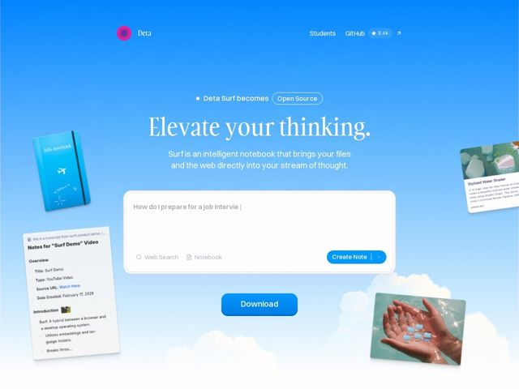

# Deta — https://deta.surf

- **niche:** productivity
- **mood:** warm-playful
- **style:** gradient, photographic, colorful
- **palette:** bg `#1E90F5` · ink `#F5F2EA` · accent `#E0218A` — Single magenta logo orb top-left and the pink chip in the floating 'Stylized Water Shader' card; everything else lives in the blue/cream system so the one hot-pink dot does all the brand-recall work
- **type:** display *Gambarino* · body *Switzer* — Oversized high-contrast serif headline (Gambarino) feels editorial and literary — 'elevate your thinking' made typographic — set against a clean neutral grotesk body (Switzer) and a condensed Tanker accent face; warm, smart, un-techy
- **sections:** hero › feature-generate-notes › feature-explore › feature-private-open › feature-all-in-one › how-it-works › testimonials › cta › footer
- **signature:** The entire hero is a literal sky — a photographic blue-to-cloud gradient — with the product's own UI artifacts (a felt notebook, sticky transcript notes, a shader card, a hand cradling tiny floating windows) drifting through it like objects caught mid-thought. The page IS the metaphor: your files and the web floating in a 'stream of thought.'
- **imagery:** Photographic gradient-mesh sky (real clouds, not CSS) as the canvas, with realistic 3D-rendered/composited product cards and a literal photo of a hand holding miniature app windows scattered at playful tilt angles around a central interactive prompt box. Treatment is warm, soft-shadowed, slightly surreal collage — tangible objects in an open sky rather than flat UI mockups.
- **copy:** Aspirational two-word imperative that sells a feeling, not a feature — hero reads 'Elevate your thinking.' with the subhead doing the literal explaining ('Surf is an intelligent notebook that brings your files and the web directly into your stream of thought.'); section heads continue the verb-first cadence ('Search less. Think better.', 'Explore your interests from another level.')

**Takeaways (steal as ideas, don't copy):**
- Make the hero input box the actual product, not a screenshot: a live prompt field pre-filled with a real query ('How do I prepare for a job intervie|' with a blinking cursor) plus a real CTA ('Create Note') invites the visitor to mentally use it before downloading.
- Spend your one saturated color exactly once — a single hot-pink logo orb on a sea of sky-blue — so the brand mark is unmissable and nothing competes with it.
- Float product fragments at slight rotations (notebook, sticky notes, shader card) around the center instead of one tidy device mockup; the scattered tilt sells 'everything in one place / stream of thought' better than any caption.
- Pair a big literary contrast-serif headline with a plain grotesk body to read as 'thoughtful tool, not another AI app' — the type does the warm-playful positioning the screenshots can't.
