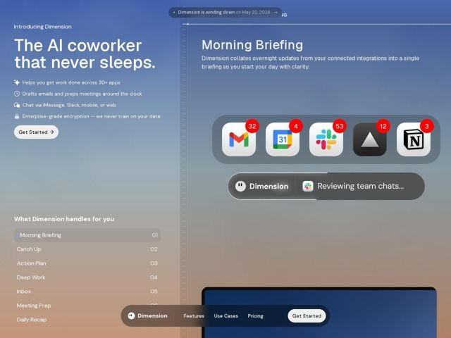

# Dimension — https://dimension.dev

- **niche:** ai
- **mood:** premium-luxe
- **style:** glass, gradient, bento
- **palette:** bg `#7B96C4` · ink `#FFFFFF` · accent `#F35B45` — Reservado quase inteiramente para os contadores vermelhos dos badges de notificação na bandeja flutuante de ícones de app (32/4/53/12/3); todo o resto é monocromático branco-sobre-gradiente, então o vermelho quente lê-se como o único ponto de urgência/vida
- **type:** display *Geometric grotesque sans (Inter Display / Söhne-like, tight tracking, near-black weight)* · body *Humanist sans (same family at regular weight) with small line-leading icons* — Calmo, premium, nativo de software; peso de headline grande e confiante contra um corpo arejado — parece um sistema operacional, não uma página de marketing
- **sections:** hero › feature-index › feature-morning-briefing › feature-catch-up › feature-action-plan › feature-deep-work › feature-inbox › feature-meeting-prep › feature-daily-recap › cta › footer
- **signature:** Uma tela dividida sincronizada com o scroll: a coluna esquerda contém um índice vertical numerado (01 Morning Briefing -> 07 Daily Recap) funcionando como sumário, enquanto o painel direito é um único canvas de produto persistente que troca seu mock de UI ao vivo conforme cada linha do índice se ativa. A lista de recursos É a navegação, e a demo nunca sai da tela.
- **imagery:** UI-do-produto-como-hero renderizada em vidro: chrome de app de aparência real flutuando sobre um fundo de malha-gradiente. Bandeja fosca de ícones de app com Gmail/Calendar/Slack/Notion e badges vermelhos de não-lidas, uma pílula de status translúcida ("Dimension — Reviewing team chats..."), e uma nav de vidro flutuante. Sem fotografia, sem 3D abstrato — a imagem é o produto simulando um desktop de sistema operacional. Tratamento: backdrop-blur intenso, realces internos suaves, arredondamento generoso, sombras sutis.
- **copy:** One-liner antropomórfico e confiante que vende um resultado, não recursos — o hero diz "The AI coworker that never sleeps." (eyebrow: "Introducing Dimension"), reforçado por linhas de benefício estilo checklist, cada uma liderada por um pequeno ícone mono.

**Takeaways (roube como ideias, não copie):**
- Transforme sua lista de recursos na espinha dorsal da página: numere as capacidades (01-07) numa coluna esquerda fixa e deixe a linha ativa comandar um único canvas de produto persistente à direita — poupa você de 7 blocos de recurso repetitivos.
- Vá quase monocromático (tinta branca sobre gradiente) e gaste sua ÚNICA cor saturada em sinais funcionais de UI — aqui os badges vermelhos de não-lidas — para que o destaque se leia como 'o produto está vivo' em vez de decoração.
- Construa uma malha-gradiente que viaja emocionalmente: azul corporativo frio no topo desbotando para pêssego/areia quente embaixo, espelhando a narrativa 'noite -> briefing matinal' do próprio produto.
- Renderize o hero como um falso sistema operacional: dock fosco de ícones de app com logos familiares de terceiros + uma pílula de status translúcida mostrando a IA no meio de uma tarefa ('Reviewing team chats...') — comprova amplitude de integração e agência ao vivo num só olhar, sem precisar de texto.
