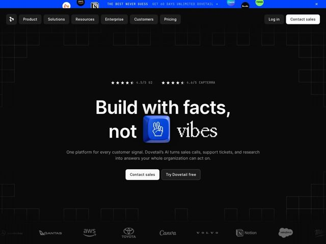

# Dovetail — https://dovetail.com

- **niche:** ai
- **mood:** technical-dark
- **style:** dark, 3d, mono-type, gradient
- **palette:** bg `#000000` · ink `#FFFFFF` · accent `#2C5FF6` — Barra de ticker azul-elétrico no topo, o objeto 3D de keycap em pixel embutido no headline, e estados de link/hover; todo o resto é quase monocromático para que o azul se leia como um único impacto deliberado
- **type:** display *Space Grotesk* · body *Inter* — Headline pesado em geometric-grotesk, composto apertado e superdimensionado para uma voz direta e confiante; o Inter mantém o corpo neutro e confiável; o JetBrains Mono comanda o ticker em caixa alta e os micro-rótulos para uma sensação de console/forense, com PP Mondwest + EB Garamond em reserva como acentos retrô-pixel e editorial
- **sections:** ticker-bar › nav › hero › logos › feature-built-for-trust › feature-drive-consistency › feature-privacy-without-friction › feature-pii-redaction › feature-ai-you-can-trust › feature-private-ai › cta › footer
- **signature:** Um keycap de teclado em pixel-art 3D brilhante (com um cursor de mão fazendo sinal de paz em cima) está encaixado no meio do headline do hero como um objeto físico substituindo uma palavra — transformando tipografia plana num remate tátil, quase de brinquedo, que subverte o habitual hero estéril e todo-em-texto de plataforma de IA.
- **imagery:** Quase nenhuma fotografia. Uma tênue grade de planta arquitetônica recua no vazio preto, ancorada por um único objeto keycap 3D hiper-renderizado como o artefato focal solitário. Logos de marca aparecem como cinzas fantasmagóricos esmaecidos na parede, mais minúsculos ícones coloridos de app (Notion, Canva, AWS, Wise, Breville) escondidos na barra de ticker. O tratamento é forense e construído, em vez de lifestyle.
- **copy:** Voz declarativa direta e contrária que compra briga com o hype — o hero diz "Build with facts, not vibes" sobre um subhead funcional e simples sobre transformar cada sinal do cliente em ação.

**Takeaways (roube como ideias, não copie):**
- Embuta um objeto 3D renderizado DENTRO do texto do headline como substituição de palavra para que a própria tipografia vire a arte do hero — sem precisar de uma foto de produto separada.
- Rode uma barra de ticker fina com acento elétrico bem no topo com copy em caixa alta mono + minúsculos ícones reais de app; funciona ao mesmo tempo como banner promocional e como sinal de 'integramos com estes'.
- Mantenha 95% da página monocromática sobre preto puro para que uma única cor de destaque saturada carregue toda a energia — a contenção faz o único azul parecer intencional.
- Empilhe um sistema tipográfico deliberadamente amplo (display geometric-grotesk + corpo sans neutro + rótulos mono + um acento retrô pixel/serifa) para parecer ao mesmo tempo rigoroso e divertido, em vez de um sans plano em tudo.
