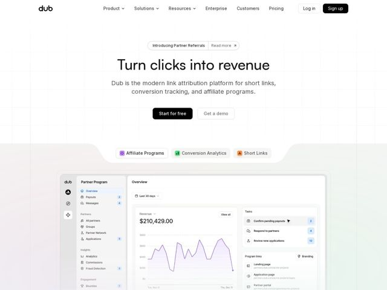

# Dub — https://dub.co

- **niche:** analytics
- **mood:** clean-light
- **style:** minimal, clean, bento
- **palette:** bg `#FFFFFF` · ink `#171717` · accent `#171717` — Near-black is the primary action color: the solid 'Start for free' CTA, 'Sign up' button, logo, and h1 all share it. Real chromatic accent is reserved — a violet/purple (#8B5CF6) appears only inside the product UI (revenue line chart, app-pill icon) and category pills (purple/green/orange), so color reads as 'product data,' not 'marketing chrome.'
- **type:** display *Geometric grotesque sans (Dub uses a custom/Inter-adjacent display; letterforms read like a tight single-story 'a' grotesque — closest off-the-shelf is 'General Sans' or 'Inter Display')* · body *Inter (neutral humanist sans)* — Confident, engineered, quiet — large tight-tracked display over calm gray body; zero personality flourish, all clarity
- **sections:** hero › feature-it-starts-with-a-link › feature-measure-what-matters › logos › feature-connect-integrations › feature-partnerships › feature-built-to-scale › feature-enterprise-infrastructure › testimonials › cta › changelog-we-ship-fast › footer
- **signature:** The hero product screenshot is 'launched' from a notched white tray: three category pills (Affiliate Programs / Conversion Analytics / Short Links) sit in a rounded cutout shelf, and the dashboard slides up out of it — the chrome of the page itself frames the product like a slot, instead of the usual flat browser-mockup-on-gradient.
- **imagery:** Product-screenshot first. A real, high-fidelity in-app dashboard (Partner Program: revenue chart reading $210,429.00, tasks list, program links) rendered crisp and legible at full size — not a blurred prop. Background is near-white with a barely-there faint blueprint grid that fades to nothing, plus a soft warm-to-cool gradient wash at the tray edges. No 3D, no illustration, no stock photography.
- **copy:** Outcome-over-feature: a 4-word benefit headline 'Turn clicks into revenue' with a plain-spoken subhead naming the three jobs (short links, conversion tracking, affiliate programs); calm, declarative, founder-direct voice.

**Takeaways (steal as ideas, don't copy):**
- Pin a real number as proof: the hero dashboard leads with '$210,429.00' revenue, so the screenshot doubles as a credibility claim — show the metric your buyer dreams about, not lorem data.
- Use a notched 'tray' cutout to seat the product shot: a rounded shelf with category-toggle pills makes the screenshot feel like a live launcher, and lets one image stand in for three product pillars.
- Spend color only inside the product: keep marketing chrome monochrome near-black, and let the lone purple live in the chart line and app icons so the UI is the most colorful thing on screen.
- Map section headings to a benefit ladder, not feature names: 'It starts with a link' to 'Measure what matters' to 'Grow with partnerships' to 'Built to scale' walks the reader from first action to enterprise outcome.
- End on momentum: a 'We ship fast' changelog section near the footer turns release velocity into a trust signal for a developer/marketer audience.
