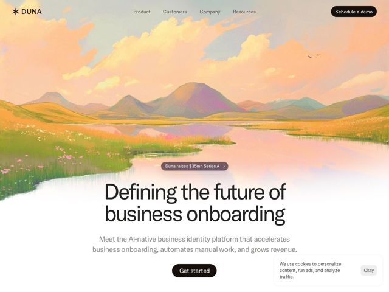

# Duna — https://duna.com

- **niche:** fintech
- **mood:** warm-playful
- **style:** illustrated, colorful, photographic
- **palette:** bg `#FBF6EE` · ink `#2B2622` · accent `#F2A65A` — Diffused through the hero illustration (peach clouds, golden hills, pink river reflections) rather than as UI chrome; primary CTAs/nav pill are near-black on cream, so the warm peach-to-lilac gradient IS the brand accent.
- **type:** display *Neue Haas Grotesk / GT America-style grotesque (tight, large, slightly condensed sans)* · body *Same humanist-leaning grotesque at lighter weight* — Confident, modern, neutral-but-warm; oversized lowercase display does the emotional work while the type itself stays restrained
- **sections:** hero › logos › problem › feature-onboard › feature-case-management › feature-compliance › feature-data-orchestration › feature-security › testimonials › news › cta › footer
- **signature:** Leading a hardcore compliance/KYB fintech product with a serene, hand-painted nature landscape — emotional, calm, almost meditative — the opposite of the cold dashboard screenshots the category defaults to.
- **imagery:** Hero is a full-bleed painterly illustration: a pastel sunrise valley with rolling hills, a mirror-still river, and soft cloud bands in peach/lilac/sage. Hand-painted, gouache-like texture (not 3D, not photo). It fades to white at the bottom so dark text reads cleanly over the lower third.
- **copy:** Calm, declarative authority — "Defining the future of business onboarding" — abstract category-ownership framing ("The new standard in compliance") paired with benefit-led feature heads like "Drive revenues with Duna Onboard."

**Takeaways (steal as ideas, don't copy):**
- Defuse a heavy/regulated category (compliance, KYB, security) with a soft hand-painted landscape hero — the emotional contrast is the whole hook.
- Float a funding/news badge ('Duna raises $35mn Series A') as a translucent dark pill centered just above the H1 — credibility without a separate banner.
- Bottom-fade the illustration into a solid cream so you can drop large dark display type and a black CTA over a busy image with zero overlay scrim.
- Pair an abstract category claim ('The new standard in compliance') with concrete revenue/time benefit feature heads ('Drive revenues', 'Save time') so the page feels visionary AND practical.
