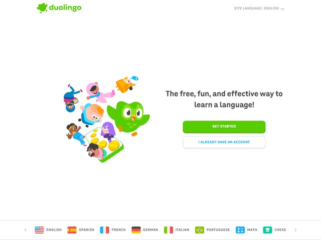

# Duolingo — https://www.duolingo.com

- **niche:** education
- **mood:** warm-playful
- **style:** illustrated, rounded, friendly, mascot-led
- **palette:** bg `#FFFFFF` · ink `#3C3C3C` · accent `#58CC02` — O verde-grama característico da Duolingo é reservado para o logotipo e a pílula CTA primária encorpada; o botão secundário "I already have an account" é uma pílula branca com contorno verde + rótulo em caixa alta verde, então o verde carrega 100% da carga de cor de ação.
- **type:** display *geometric rounded sans à la "Feather Bold" / Nunito Bold (Duolingo's house typeface)* · body *same rounded family, lighter weight* — Suave, saltitante, seguro para crianças; os terminais arredondados fazem até o headline parecer acessível em vez de corporativo.
- **sections:** hero › language-picker-bar › how-it-works › science-backed-method › gamification-streaks › social-proof › app-download-cta › footer
- **signature:** Uma pilha solta e fora-da-grade de personagens de desenho — o coruja verde Duo no meio de um gesto, um urso rosa, uma figura fantasiada de astronauta, aprendizes humanos diversos, moedas de ouro derramando de um celular — é dropada à ESQUERDA da copy, não centralizada nem emoldurada. Não há mockup de dispositivo, nem UI, nem foto: todo o argumento visual é um amontoado de mascotes que diz "isto é brincadeira, não estudo." A composição é deliberadamente assimétrica com margens brancas enormes, deixando o aglomerado de personagens respirar como uma folha de adesivos.
- **imagery:** Apenas ilustração vetorial flat — personagens arredondados e de alta saturação com volume implícito espesso e zero contorno. Sem capturas de tela de produto, sem renders 3D, sem fotografia. Moedas de ouro e a forma do celular insinuam o app gamificado sem nunca mostrar a interface real.
- **copy:** Calorosa, direta e benefício-primeiro com um ponto de exclamação — o headline diz "The free, fun, and effective way to learn a language!" O ritmo de três adjetivos (free / fun / effective) antecipa as três objeções que os aprendizes têm, e o CTA é um confiante "GET STARTED" em caixa alta.

**Takeaways (roube como ideias, não copie):**
- Substitua a captura de tela do produto por um elenco de personalidade: uma pilha de personagens da marca pode carregar o hero melhor que a UI quando a promessa é emocional ("diversão"), não baseada em recursos.
- Derrube as três maiores objeções no próprio headline com um tripleto de adjetivos paralelos ("free, fun, and effective") antes do substantivo.
- Deixe a ação secundária ser uma pílula contornada de baixo contraste para que o único CTA verde-saturado seja dono de toda a urgência visual.
- Posicione o visual fora do centro contra um espaço branco generoso para que a ilustração se leia como um adesivo brincalhão em vez de um banner enquadrado.
