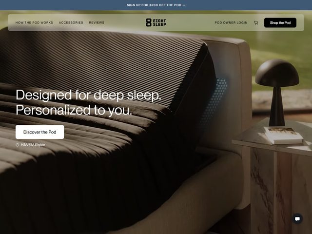

# Eight Sleep — https://www.eightsleep.com

- **niche:** health
- **mood:** premium-luxe
- **style:** photographic, warm, cinematic, minimal
- **palette:** bg `#3B3A33` · ink `#F4F2EC` · accent `#5B9BD8` — O azul vive em exatamente um lugar: um minúsculo aglomerado de luzes-sensor pontilhadas e brilhantes na superfície do colchão, sinalizando "este tecido está vivo / está rastreando você." Todo o resto são tons terrosos quentes e tipografia off-white; o azul frio é o único indício de tecnologia numa fotografia, de resto, orgânica.
- **type:** display *geometric grotesque, slightly humanist (Aktiv Grotesk / Söhne)* · body *same family, small caps for eyebrow nav* — Calmo, confiante, em sentence case com pegada de caixa baixa; a tipografia sussurra em vez de gritar, dimensionada grande mas com tracking relaxado.
- **sections:** hero › how-the-pod-works › temperature-sleep-tracking › autopilot-ai › results-and-reviews › accessories › cta › footer
- **signature:** O hero é uma fotografia real de quarto montada como um catálogo de móveis — edredom bege, criado-mudo de mármore, uma luminária escultural em forma de cogumelo, jardim verde-sálvia desfocado ao fundo — mas a capa Pod escura e canelada fica em cima da cama como o óbvio "intruso", e uma única mancha de luzes azuis pontilhadas brilha em sua superfície. Vende um dispositivo de tecnologia de US$ 2 mil+ escondendo a tecnologia dentro de uma foto de lifestyle aspiracional, quase de interiores editoriais; a única prova de que é um gadget é aquele brilho azul de sensor.
- **imagery:** Fotografia cinematográfica de produto-em-contexto full-bleed. Profundidade de campo rasa, gradação dourada e quente, materiais reais (linho, mármore, o topper de colchão tecnológico com aletas). Sem renders 3D, sem UI, sem ilustração — o realismo e o styling fazem o trabalho de luxo.
- **copy:** Aspiracional e direta, duas linhas curtas empilhadas em grande em off-white: "Designed for deep sleep. Personalized to you." Eyebrow promocional na barra superior "SIGN UP FOR $200 OFF THE POD →"; uma pequena linha de confiança sob o CTA diz "HSA/FSA Eligible" com um ícone de check. O CTA primário é uma pílula fantasma/contorno "Discover the Pod"; a pílula escura preenchida "Shop the Pod" fica na nav.

**Takeaways (roube como ideias, não copie):**
- Venda um dispositivo de tecnologia através de uma foto de lifestyle de revista de interiores e então plante UM detalhe de destaque brilhante como a única prova de que é inteligente — deixe o gadget se esconder dentro da aspiração.
- Puxe toda a paleta da própria fotografia (fundo terroso quente, tinta off-white) para que tipografia e imagem pareçam um único quadro contínuo, não texto-sobre-imagem.
- Divida o headline em duas linhas declarativas curtas — um benefício ("deep sleep") mais uma promessa ("personalized to you") — em vez de uma alegação longa.
- Empilhe uma micro-linha de credibilidade ("HSA/FSA Eligible") diretamente sob o CTA para reduzir o risco de um preço premium de forma discreta, sem quebrar o clima calmo.
