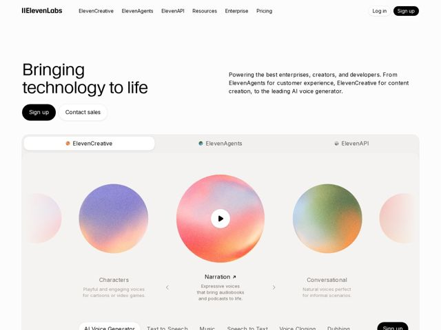

# Elevenlabs — https://elevenlabs.io

- **niche:** ai
- **mood:** clean-light
- **style:** minimal, gradient, mono-type
- **palette:** bg `#FFFFFF` · ink `#0A0A0A` · accent `#F06A4D` — Lives only inside the grainy spherical gradient orbs in the hero carousel (coral-to-violet-to-green blends); the surrounding UI stays strictly black-on-white with pill buttons.
- **type:** display *Geist-style geometric grotesque (large, tight, lowercase-friendly sans)* · body *Same neutral grotesque at regular weight, generous line-height* — Calm, premium, near-editorial restraint; the type recedes so the color orbs and audio do the talking.
- **sections:** hero › logos › feature-two-platforms › feature-create-edit-localize › feature-deploy-agents › feature-apis › stats-impact › research › feature-safety › blog-updates › footer
- **signature:** A horizontal "orbital" carousel of grainy, planet-like gradient spheres standing in for voices/sound — abstract cosmic blobs with a single play button in the center, where a dev-tools page would normally show a code editor or product screenshot.
- **imagery:** No photos or UI screenshots in the hero. Instead, soft noise-textured radial-gradient spheres (each a different multicolor blend) float on white, evoking audio waveforms as celestial objects. Tabs (ElevenCreative / ElevenAgents / ElevenAPI) sit above, sub-pills (AI Voice Generator, Text to Speech, Music) below — turning the hero into an interactive instrument.
- **copy:** Aspirational and humanist, not feature-led — "Bringing technology to life" with a plain-spoken support line about enterprises, creators, and developers.

**Takeaways (steal as ideas, don't copy):**
- Replace the obligatory product screenshot with an abstract, brand-defining object (here, grainy gradient spheres) so color and motion carry the identity instead of UI chrome.
- Keep the entire chrome monochrome black-on-white and let saturated color appear ONLY inside the hero centerpiece — maximum pop from minimum surface.
- Use grain/noise on gradients to make flat color feel physical and premium rather than slick and synthetic.
- Make the hero a live instrument: tabs above + capability pills below + a single play button turn a static headline into a demo-on-arrival.
