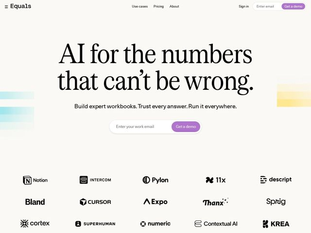

# Equals — https://equals.app

- **niche:** data
- **mood:** editorial-minimal
- **style:** minimal, mono-type, colorful
- **palette:** bg `#F7F5EF` · ink `#1A1A1A` · accent `#B98FD9` — Botões CTA em pílula preenchida ('Get a demo'), o estado ativo do botão de captura de e-mail; deliberadamente a ÚNICA cor saturada no chrome — todo o resto é tinta-sobre-creme
- **type:** display *A high-contrast transitional serif (Times/Georgia-adjacent, likely a refined cut like Tiempos or a Plantin-style face)* · body *Geometric/neo-grotesque sans for subhead, nav, and labels* — Serifa editorial-impressa e autoritária encontra um sans fintech limpo — 'um jornal que faz contas'
- **sections:** hero › logos › feature-source-of-truth › feature-pipeline-arr › feature-system-not-artifact › feature-managed-warehouse › how-it-works › cta › footer
- **signature:** O headline do hero é composto numa serifa de livro massiva e de entrelinha apertada (duas linhas que quase se tocam) sobre papel quente — uma voz inconfundivelmente EDITORIAL/impressa para uma ferramenta de dados, com a única cor sendo duas barras suaves de gradiente pastel (menta à esquerda, amarelo-manteiga à direita) sangrando para fora das bordas da página como amostras de margem. Serifa + creme + sangria-pastel é a jogada que um template SaaS genérico jamais faria.
- **imagery:** Sem capturas de tela de produto acima da dobra — a imagem é puramente tipográfica mais faixas abstratas de gradiente pastel (listras horizontais de menta/teal e amarelo-claro) sangrando para fora de ambas as bordas do hero. A grade de logos usa marcas de clientes monocromáticas em preto-tinta. O tratamento é contido, tipo papel, quase zine/impresso em vez de 3D brilhante ou mockups de dashboard.
- **copy:** Declarativas diretas que afirmam confiança e se apoiam no alívio da ansiedade — hero: 'AI for the numbers that can't be wrong.' seguido de um sub triádico ('Build expert workbooks. Trust every answer. Run it everywhere.'); os títulos de seção repetem um enquadramento confiança-vs-dúvida de 'mesma pergunta, mesma resposta' / 'pare de vibe-codar seus números, comece a confiar neles'.

**Takeaways (roube como ideias, não copie):**
- Componha o hero numa serifa grande de peso de livro sobre papel creme quente em vez de um sans sobre branco — lê-se instantaneamente como 'autoridade editorial', um forte truque de contraste para um produto de dados/finanças movido por confiança
- Restrinja TODA a cor a um único trabalho: aqui uma única pílula lavanda é o único elemento saturado em todo o chrome, de modo que cada CTA se leia como a única coisa a clicar
- Deixe barras abstratas de gradiente pastel sangrarem para fora das bordas da página (esquerda/direita do hero) como a única 'imagem' — cor e textura sem se comprometer com uma captura de tela de produto ou render 3D
- Escreva os títulos de seção como slogans pareados de confiança-vs-dúvida ('Same question? Same answer.', 'Stop vibe-coding your numbers. Start trusting them.') para tornar a confiabilidade o fio condutor emocional
