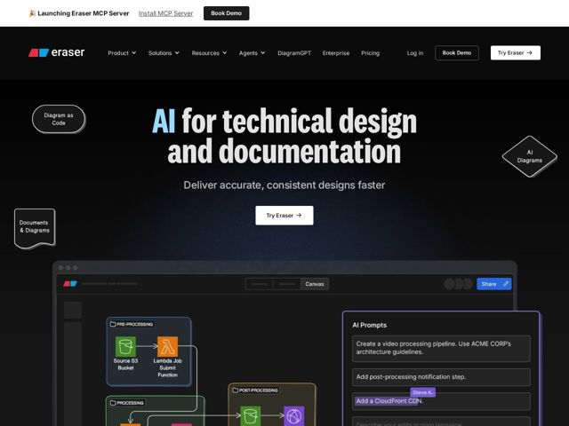

# Eraser — https://eraser.io

- **niche:** dev-tools
- **mood:** technical-dark
- **style:** dark, 3d, bold
- **palette:** bg `#0A0A0C` · ink `#EDEDED` · accent `#5CC8F5` — Cyan ignites the word 'AI' in the headline and the diagram-node logo mark; a secondary red chip and a blue 'Share' button echo the product UI palette
- **type:** display *Slab serif (heavy, condensed — Roboto Slab / Zilla Slab family)* · body *Geometric sans-serif (clean grotesque, e.g. Inter/Roboto)* — Engineering-blueprint confidence — chunky slab headlines feel hand-drawn-meets-CAD, paired with a neutral sans for utilitarian legibility
- **sections:** hero › logos › feature-diagrams › feature-documentation › feature-versioning › feature-performance › feature-commandbar › integrations › feature-export-github › security › compliance › cta › footer
- **signature:** The hero is wrapped in floating, draggable-looking diagram primitives — an oval 'Diagram as Code' node, a diamond 'AI Diagrams' decision shape, a sticky-note 'Documents & Diagrams' card — turning the landing page itself into a live whiteboard canvas instead of a flat marketing layout.
- **imagery:** Hyper-real product UI as hero: a dark code-canvas editor showing an AWS architecture diagram (S3, Lambda, color-coded process groups) beside an 'AI Prompts' panel with plain-language edit commands and a multiplayer 'Steve K.' cursor — sells the actual workflow, not an abstraction.
- **copy:** Plain-spoken outcome promise in a heavy slab voice — hero reads "AI for technical design and documentation" with the subhead "Deliver accurate, consistent designs faster."

**Takeaways (steal as ideas, don't copy):**
- Decorate the hero with the product's own UI vocabulary — float actual node/decision/sticky shapes around the headline so the page demonstrates the canvas metaphor instead of describing it.
- Tint a single semantic word in the headline (here 'AI') with the brand accent so the value-prop verb pops without adding a colored badge.
- Bake collaboration proof into the screenshot — a named teammate cursor and natural-language AI prompts inside the product shot do the 'multiplayer + AI' selling silently.
- Pair a heavy slab-serif display with a neutral sans body to read as 'serious engineering tool' while staying warm and hand-drawn, breaking the cold geometric-sans default of dev-tools sites.
