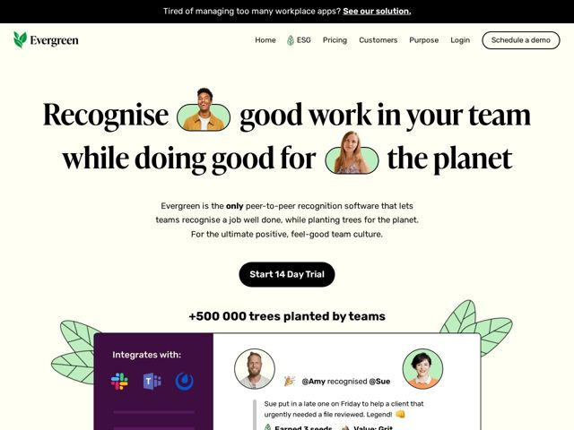

# Evergreen — https://evergreen.so

- **niche:** hr-tech (employee recognition / peer-to-peer engagement with ESG/sustainability angle)
- **mood:** warm-playful
- **style:** editorial, illustrated, colorful
- **palette:** bg `#FCFBEE` · ink `#1A1A1A` · accent `#A8D5A2` — sage-green photo lozenges behind faces in the headline, leaf doodles framing the hero, avatar ring fills, and the logo mark
- **type:** display *High-contrast Didone serif (Playfair Display / Tiempos-like) for the H1* · body *Humanist sans-serif (Poppins / similar geometric-humanist) for body and UI* — Editorial magazine-cover gravitas up top, friendly rounded sans below — old-money seriousness softened into approachable warmth
- **sections:** topbar-announcement › nav › hero › primary-cta › social-proof-stat › product-screenshot › feature-purpose › feature-seeds-to-trees › feature-reporting-carbon › feature-csr-netzero › metrics-band › closing-cta › footer
- **signature:** The H1 embeds live photos of real smiling employees inside green pill-shaped lozenges directly in the sentence flow — faces become inline typographic glyphs, turning the headline itself into the hero image instead of using a separate product shot or stock hero.
- **imagery:** Cut-out photos of real people on sage-green pill backgrounds, hand-drawn flat leaf doodles scattered as decorative framing, and a tilted product UI card showing an actual peer recognition feed (avatars, Slack/Teams integration icons, emoji, "Earned 3 seeds" gamification). Mixes warm human photography with playful botanical illustration.
- **copy:** Benefit-and-mission dual promise with a feel-good register; hero reads "Recognise good work in your team while doing good for the planet" — pairs a workplace outcome with a planetary one in a single breath.

**Takeaways (steal as ideas, don't copy):**
- Set photos of real people inside the headline as inline word-shaped tokens (green pills) so the type IS the hero — kills the need for a generic hero illustration.
- Pair a Didone display serif with a friendly humanist sans: editorial authority for the promise, warmth for everything else.
- Lean fully into an off-white cream canvas (#FCFBEE) instead of pure white — instantly signals 'natural / organic' without any green overload.
- Use a literal mission metric as social proof ('+500 000 trees planted by teams') right under the CTA so the product value and the cause are quantified together.
