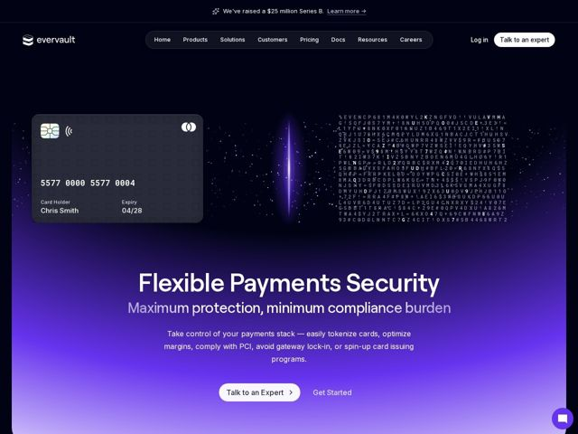

# Evervault — https://evervault.com

- **niche:** security
- **mood:** premium-luxe
- **style:** gradient, dark, 3d
- **palette:** bg `#0B0B14` · ink `#FFFFFF` · accent `#7C4DFF` — Lavagem de gradiente full-bleed violeta-para-índigo inundando o hero inferior atrás do headline; também o feixe de luz vertical, a palavra 'burden' e o balão de chat flutuante. Os CTAs invertem para branco-sobre-escuro em vez de usar o acento.
- **type:** display *Geometric grotesque sans (Inter / Söhne-like), tight-tracked, heavy weight for h1* · body *Same family, regular weight, slightly looser* — Nítido, neutro, confiável-de-engenharia; o headline em duas tonalidades (branco + lavanda suave em 'burden') adiciona um ritmo suave de ênfase
- **sections:** hero › logos › problem › feature-tokenization › feature-ownership › feature-platform › how-it-works › feature-grid › testimonials › cta › footer
- **signature:** Um cartão de pagamento fotorrealista pairando ao lado de uma fenda de luz brilhante que "descriptografa" um campo denso de glifos de cifra embaralhados — o processo de criptografia é dramatizado como um feixe literal partindo o ruído num cartão limpo, em vez de uma bolha 3D abstrata.
- **imagery:** Um artefato literal de produto (um cartão de crédito escuro realista, "Chris Smith 5577 0000 5577 0004") flutuando no espaço, combinado com uma fenda de luz vertical brilhante e uma parede de caracteres de cifra embaralhados representando criptografia — objeto concreto encontra ruído-de-dados abstrato.
- **copy:** Voz liderada por benefício, segurança-como-confiança. Hero: "Flexible Payments Security" com sub "Maximum protection, minimum compliance burden" — o resultado enquadrado como remover um fardo, não adicionar tecnologia.

**Takeaways (roube como ideias, não copie):**
- Headline em duas tonalidades: componha a segunda oração numa tonalidade suavizada da mesma cor para que uma palavra-chave (aqui 'burden') recue — adiciona ritmo sem uma segunda fonte ou peso.
- Dramatize o mecanismo literalmente: em vez de uma forma 3D genérica, renderize o artefato real que seu produto protege (um cartão) emergindo de um feixe de luz cortando o ruído de caracteres criptografados.
- Mantenha os CTAs branco-sobre-escuro e reserve o acento saturado puramente para a atmosfera (lavagem de gradiente + feixe de luz), para que os botões se leiam como o alvo de toque mais brilhante numa página escura.
- Ancore o hero escuro com um único florescimento de gradiente violeta de baixo-para-cima atrás da copy — eleva a legibilidade do texto e dá a uma página de resto plana e quase-preta um brilho focal.
