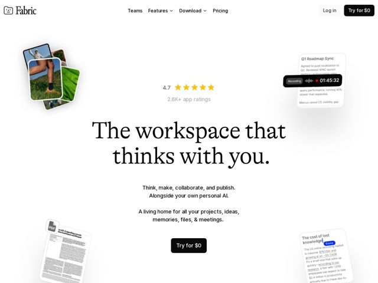

# Fabric — https://fabric.so

- **niche:** productivity
- **mood:** editorial-minimal
- **style:** minimal, mono-type
- **palette:** bg `#FFFFFF` · ink `#0A0A0A` · accent `#F5B301` — Only on the star-rating row (4.7 / 2.6K+ ratings) as social-proof gold stars; the primary CTA stays pure black, so the warm yellow is the single chromatic spark on an otherwise black-and-white canvas.
- **type:** display *A high-contrast transitional serif (Tiempos / Lyon-like), large and tight* · body *A neutral grotesque sans (Inter / Söhne-like)* — Editorial and literary up top, calm utilitarian below — book-cover headline over an app-UI body
- **sections:** hero › logos › feature-create › feature-think-ai › feature-models › feature-collaborate › feature-publish › problem › feature-search › feature-integrations › feature-compatibility › feature-file-understanding › feature-unified › feature-always-with-you › feature-teams › feature-security › how-it-works › feature-more › cta › footer
- **signature:** The hero defies SaaS convention: instead of one big product screenshot, real app UI fragments (a live voice-recording card mid-timer at 01:45:32, an AI research note, a PDF, a photo stack) float in from the page edges and bleed off-frame, framing a centered serif headline like marginalia around a book title — the chrome is decentered so the sentence is the hero.
- **imagery:** Product-screenshot UI, but deconstructed: individual feature cards (recording widget, AI note, document, image stack) shown as floating rounded-rectangle fragments with soft drop shadows on bare white, half-cropped by the viewport. No device frames, no gradient mesh, no 3D — the negative space does the work.
- **copy:** Literary, second-person and quietly ambitious — the product as a thinking companion rather than a tool. Hero h1: "The workspace that thinks with you." with subhead "Think, make, collaborate, and publish. Alongside your own personal AI."

**Takeaways (steal as ideas, don't copy):**
- Replace the single hero screenshot with 4-5 half-cropped UI fragments floating off the page edges around a centered headline — let negative space and bleed imply a larger product without showing it.
- Put one human, specific detail inside a product mock to prove it's real software, not a stock render: a live recording timer counting at 01:45:32 sells 'it actually works' better than any feature label.
- Pair a high-contrast literary serif headline with a plain grotesque body — the serif carries the brand's 'thinks with you' ambition while the sans keeps the dense feature stack readable.
- Spend your only accent color on social proof, not the CTA: gold stars on the 4.7 rating row, black CTA button — restraint makes the one warm color register as trust, not decoration.
- Price the CTA as the headline: 'Try for $0' instead of 'Sign up free' turns the button itself into the offer.
