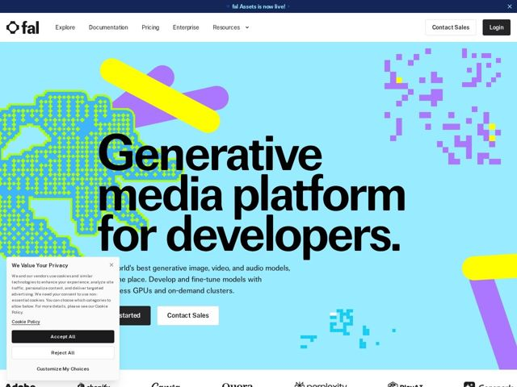

# Fal — https://fal.ai

- **niche:** ai
- **mood:** bold-loud
- **style:** bold-loud, brutalist, colorful, mono-type
- **palette:** bg `#9FE0F5` · ink `#0A0A0A` · accent `#F5F500` — ilustração abstrata de blobs em pixel no hero — formas de fita amarela + roxa espalhadas sobre um campo ciano; ecoada também em confetes de pixel espalhados e na barra de anúncio azul-marinho
- **type:** display *Grotesca geométrica sem serifa (estilo Helvetica/Akzidenz, grotesca pesada), peso quase preto, tracking ultra-apertado, wordmark hifenizado em múltiplas linhas* · body *Grotesca sem serifa neutra e limpa, peso regular* — Barulhenta, confiante, quase como um pôster — a manchete se comporta como um objeto tipográfico, não como uma frase. Entrelinha apertada + peso enorme fazem da tipografia o elemento visual principal.
- **sections:** announcement-bar › hero › logos › feature-explore-models › feature-build-deploy-train › feature-why-fal › cta-enterprise › footer
- **signature:** Um canvas ciano vívido com ilustrações de "blobs em pixel" 8-bit posicionadas à mão e glifos de fita amarela/roxa — marcas de infraestrutura de dev-tool quase universalmente apostam no technical-dark; a fal inverte isso para uma estética de pôster brincalhona, quase no brilho de MS-Paint, enquanto ainda vende infraestrutura de GPU séria.
- **imagery:** Sem UI de produto ou fotografia no hero. Em vez disso: arte vetorial abstrata em cores chapadas — blobs lo-fi pixelados, fitas diagonais amarelas/roxas e "confetes" de pixel espalhados — pousados sobre um plano ciano saturado. Decorativa, conduzida pela marca, com cara de arte generativa em vez de literal.
- **copy:** Direta, declarativa, falando como desenvolvedor; a manchete É a proposta de valor, montada como um pôster empilhado. H1 real: "Generative media platform for developers."

**Takeaways (roube como ideias, não copie):**
- Trate a H1 como um pôster tipográfico de 4 linhas: grotesca massiva quase preta, quebrando as palavras com hífen, entrelinha tão apertada que as linhas se tocam — a tipografia vira a imagem-herói.
- Desafie o clima padrão da categoria: escolha uma única cor de fundo saturada e inesperada (aqui, ciano elétrico) e dedique todo o hero a ela, sem rede de segurança de gradiente.
- Use blobs decorativos lo-fi 'pixel' / 8-bit como textura de marca para humanizar a infraestrutura pesada — sinaliza 'brincalhão + generativo' sem mostrar um único screenshot.
- Combine uma única cor primária brilhante (amarelo) contra o campo frio para fitas de destaque de alta energia, mantendo a tinta preto puro para legibilidade máxima sobre a cor.
