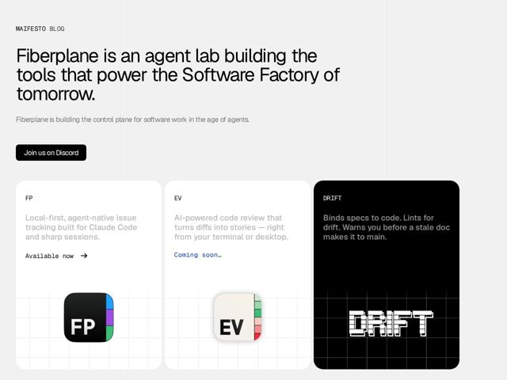

# Fiberplane — https://fiberplane.com

- **niche:** dev-tools
- **mood:** technical-dark
- **style:** minimal, mono-type, bento
- **palette:** bg `#F0F0F0` · ink `#111111` · accent `#1A56DB` — Sole color hit lives in the mono-type product status links ('Coming soon…') and inside the FP app-icon's colored sidebar tabs; everything else is grayscale
- **type:** display *Grotesque sans-serif (Helvetica Now / Neue Haas Grotesk family) — tight, optically large, near-black weight for the h1* · body *Monospace (JetBrains Mono / Berkeley Mono character) for labels, eyebrow nav, CTAs and product blurbs* — Engineer's notebook meets brutalist poster — a big confident grotesk shout sitting on a grid of typewriter-precise mono captions
- **sections:** hero › cta › feature-bento
- **signature:** The product-card bottoms ARE the demo: each app's actual icon/glyph (glossy FP iOS-style icon, cream EV icon, pixelated 'DRIFT' wordmark) floats on a faint engineering-blueprint grid that bleeds out of the card — the marketing artwork is literally the shipped artifact, no mockups or screenshots
- **imagery:** No photography, no illustration, no UI screenshots. Imagery is three product 'object' icons rendered as physical app icons (rounded-rect, drop shadow, glossy/matte material study) sitting on a hairline graph-paper grid. The third card inverts to pure black with a glitchy pixel-font wordmark, turning the grid into a CRT/terminal field
- **copy:** Founder-manifesto voice: stakes a big-picture claim, no feature list. Hero verbatim: 'Fiberplane is an agent lab building the tools that power the Software Factory of tomorrow.'

**Takeaways (steal as ideas, don't copy):**
- Let the product's own icon/wordmark be the only imagery — render it as a tactile material object floating on a faint blueprint grid instead of fabricating UI screenshots
- Pair one oversized near-black grotesk headline against an all-monospace caption layer (eyebrow nav, CTAs, card labels) so the type contrast alone carries the brand
- Spend your single accent color on ONE thing only — a status word like 'Coming soon…' — and keep literally everything else grayscale for maximum signal
- Invert one bento card to pure black with a glitch/pixel wordmark to differentiate a 'future' product from 'available now' ones without a single word of explanation
