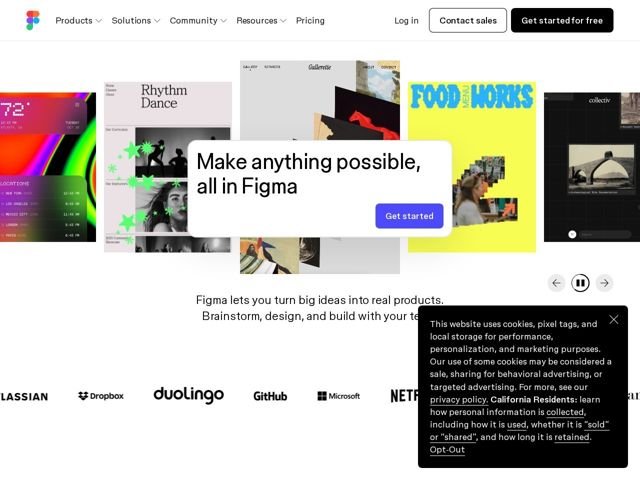

# Figma — https://figma.com

- **niche:** design
- **mood:** bold-loud
- **style:** colorful, photographic
- **palette:** bg `#FFFFFF` · ink `#1E1E1E` · accent `#4C4CFF` — Botões de CTA principais (Get started / Get started for free) e sublinhados de links inline; deliberadamente a ÚNICA cor sólida saturada no chrome, então o arco-íris vem do trabalho exibido, não da UI.
- **type:** display *Sem serifa grotesca customizada (grotesca geométrica estilo 'Whyte' da Figma) — tracking apertado, tamanho óptico grande* · body *Mesma família em peso regular / fallback grotesco do sistema* — Neutra, confiante, grotesca suíça; intencionalmente quieta para que os canvas coloridos carreguem toda a estridência
- **sections:** hero › logos › feature-use-cases › feature-roles › feature-organizations › how-it-works › feature-learn › feature-ai-first-idea-to-product › feature-systems-that-scale › feature-ship-any-way › community-gallery › templates › social › footer
- **signature:** A manchete do hero vive dentro de um "card" branco flutuante com seu próprio botão Get-started, estacionado EM CIMA de um carrossel ao vivo de canvas reais de clientes rolando atrás dele — o texto de marketing é literalmente um objeto Figma pousado sobre a superfície de design, então a página É a demo do produto.
- **imagery:** Um carrossel horizontal de canvas Figma reais e radicalmente diferentes (uma UI de app de clima, um pôster "Rhythm Dance", um zine maximalista "Food Works", um site de fotos de arquivo) — produto-como-prova, mostrando o alcance da ferramenta em vez do chrome dela. Controles de play/pause + setas sinalizam que faz autoplay.
- **copy:** Promessa imperativa de três palavras que funde a marca na afirmação — "Make anything possible, all in Figma" — voz confiante, expansiva, de produto-como-canvas.

**Takeaways (roube como ideias, não copie):**
- Deixe o chrome da UI quase monocromático (bg branco, tinta quase preta, UM destaque elétrico) e terceirize toda a energia 'colorida/estridente' para o conteúdo de produto embutido — o contraste faz os dois lerem mais alto.
- Faça do hero um artefato literal do seu produto: coloque a manchete+CTA num card com cara de arrastável flutuando sobre uma superfície de trabalho ao vivo, para que os visitantes vejam a ferramenta enquanto leem o pitch.
- Use um carrossel em movimento de resultados reais maximamente diferentes (app de clima, pôster de dança, zine, site de arquivo) como prova social de ALCANCE — a própria variedade vira o argumento de venda, com controles visíveis de play/pause convidando ao controle.
- Empilhe os títulos de funcionalidades como afirmações de resultado em linguagem direta ('Create one source of truth for devs and designers', 'Ship products, any way you want') em vez de nomes de funcionalidades — a escada de H2/H3 se lê como uma narrativa de valor.
