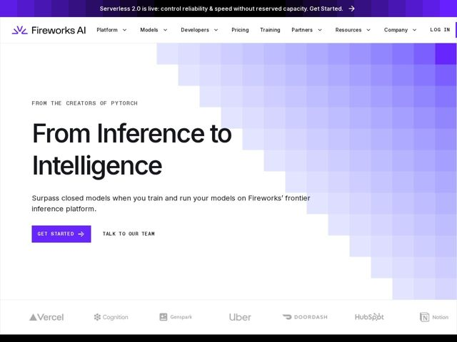

# Fireworks — https://fireworks.ai

- **niche:** ai
- **mood:** technical-dark
- **style:** minimal, gradient, mono-type
- **palette:** bg `#FFFFFF` · ink `#0A0A0F` · accent `#5B16E0` — primary CTA button fill, logo mark, top announcement bar, and the pixelated violet gradient mosaic that fills the right half of the hero
- **type:** display *Neue Haas / Helvetica-style grotesque (large, tight, near-black weight)* · body *Same humanist sans, regular weight; eyebrow and button labels set in ALL-CAPS letter-spaced mono/grotesque* — Engineer-confident and unfussy — oversized plain-spoken display headline paired with tracked-out caps eyebrows that read like terminal labels
- **sections:** announcement-bar › hero › logos › problem › feature-grid › feature-models › how-it-works › feature-lifecycle › feature-reliability › testimonials › case-study › blog › cta › footer
- **signature:** The hero ditches the obligatory product screenshot/3D render for a half-screen mosaic of low-opacity violet squares that cascades diagonally like a fading pixel staircase — turning raw GPU-grid pixels into the only visual, so empty white space carries the composition instead of UI chrome.
- **imagery:** Almost no photography or illustration in the hero: a generative grid of translucent violet squares (a pixelated descending staircase) is the entire visual language. Customer trust shown via monochrome grey wordmark logos (Vercel, Cognition, Genspark, Uber, DoorDash, HubSpot, Notion). Restrained, infra-grade, data-as-decoration.
- **copy:** Plain, declarative, momentum-named ("From Inference to Intelligence") with a credibility flex eyebrow — confident infra voice that leads with provenance, not features. Hero h1: "From Inference to Intelligence"; eyebrow: "FROM THE CREATORS OF PYTORCH".

**Takeaways (steal as ideas, don't copy):**
- Open with provenance, not a feature: a tracked-caps eyebrow ('FROM THE CREATORS OF PYTORCH') borrows authority before the headline even lands.
- Let one generative geometric motif (a fading pixel grid) be the hero art instead of a dashboard screenshot — it abstracts the product (GPU compute) into ownable decoration.
- Pair an oversized near-black grotesque headline with mono-caps micro-labels on buttons/eyebrows for an engineer-grade tension between human and machine voice.
- Use a bold violet accent sparingly — only the CTA, logo, and gradient — against pure white so the single hue reads as a brand signal, not noise.
