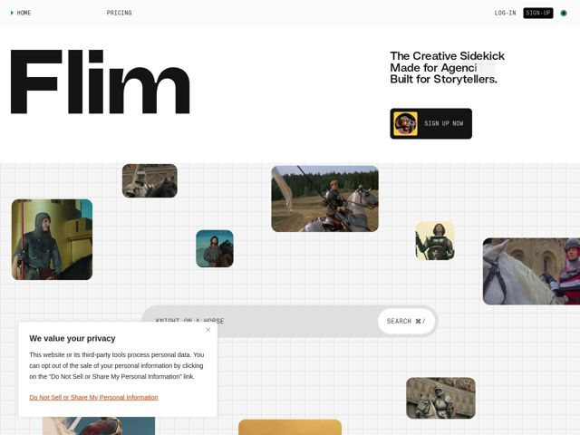

# Flim — https://flim.ai

- **niche:** ai (creative search / reference engine for filmmakers, designers, agencies)
- **mood:** editorial-minimal
- **style:** mono-type, minimal, photographic, bento
- **palette:** bg `#FFFFFF` · ink `#0A0A0A` · accent `#00C853` — pequeno glifo de logo em triângulo de play no canto superior esquerdo, o ponto de status na navegação e pequenos acentos interativos — deliberadamente esparso contra uma página que, de resto, é preto e branco
- **type:** display *Grotesca estilo Helvetica Neue / Akzidenz, extra-bold, em tamanho enorme (a palavra 'Flim' ocupa quase metade da viewport)* · body *Grotesca monoespaçada para navegação e rótulos de UI (HOME, PRICING, SEARCH ⌘/), sem serifa neo-grotesca para o subtítulo do hero* — Confiança de pôster suíço encontra mono de terminal/utilitário — precisão de texto de parede de galeria, não a redondez amigável de startup
- **sections:** hero › logos › feature-find-influences › feature-search-create › feature-tools › feature-generate-edit › feature-collaborate › feature-save-share › footer
- **signature:** O hero É a demo do produto: uma grade ao vivo espalhada de stills cinematográficos reais de referência flutuando sobre uma tênue grade de planta, com uma barra de busca real pré-preenchida lendo "KNIGHT ON A HORSE" — a página executa uma busca visual em vez de descrevê-la, quebrando a convenção de ferramentas de IA de liderar com uma caixa de chat ou um gradiente abstrato.
- **imagery:** Stills fotográficos cinematográficos (frames de filme, fotografia) apresentados como uma colagem solta de moodboard / Pinterest-encontra-grade em tamanhos variados e cantos arredondados, espalhados sobre uma grade quadriculada em linha fina. As imagens são o conteúdo, não decoração — vendem diretamente a recompensa do resultado de busca.
- **copy:** Declarativa, com cadência de tagline de agência em linhas curtas empilhadas — o hero lê "The Creative Sidekick / Made for Agencies / Built for Storytellers." combinado com títulos de seção como "Search Beautifully. Create Purposefully."

**Takeaways (roube como ideias, não copie):**
- Faça do hero um artefato funcional: uma caixa de busca real e pré-preenchida + uma grade de resultados ao vivo transforma o 'mostre, não conte' numa demo literal acima da dobra.
- Combine uma palavra de display neo-grotesca superdimensionada com o chrome de UI em monoespaçada — o contraste tipográfico sozinho se lê como 'ferramenta para criativos sérios' sem nenhuma ilustração.
- Racione o destaque: uma página quase monocromática com UM glifo verde faz a cor parecer intencional e premium em vez de decorativa.
- Faça conteúdo fotográfico flutuar sobre uma tênue grade de planta/quadriculada para sugerir estrutura e 'buscabilidade' sob o caos orgânico do moodboard.
