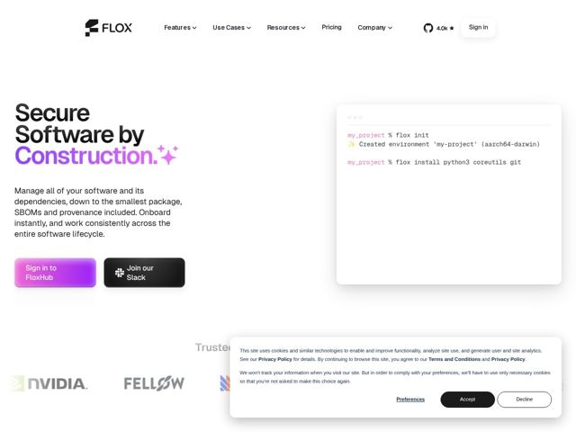

# Flox — https://flox.dev

- **niche:** dev-tools
- **mood:** technical-dark
- **style:** gradient, mono-type, minimal
- **palette:** bg `#FFFFFF` · ink `#1A1A1A` · accent `#C04CF5` — the third headline word in a magenta-to-violet gradient, the primary 'Sign in to FloxHub' CTA fill, and sparkle emoji accents next to the H1
- **type:** display *Reckless / high-contrast serif-influenced grotesque (heavy slab-ish weight)* · body *Geometric humanist sans-serif* — Confident and editorial up top, engineer-credible below — the chunky display weight reads almost editorial-magazine, an unusual choice for a package-manager tool
- **sections:** hero › logos › feature-built-for-workflow › testimonials › feature-for-teams › cta › footer
- **signature:** A live terminal session card as the hero visual — not a product screenshot or 3D render, but actual `% flox init` / `% flox install` shell commands with real success output, the CLI itself shown as the hero. It trusts the audience to read code instead of marketing chrome.
- **imagery:** Almost no decorative imagery. The hero pairs a clean white canvas with a single floating terminal card (macOS traffic-light dots, monospace prompt, pink-tinted directory name, syntax-colored output). Logo wall in desaturated grayscale. Sparkle emoji used as a literal typographic flourish on the headline.
- **copy:** Bold three-word thesis statement that borrows a security-engineering term of art — hero reads "Secure Software by Construction." with the payoff word in gradient + sparkles; subcopy is plainspoken and benefit-dense ("Onboard instantly, and work consistently across the entire software lifecycle").

**Takeaways (steal as ideas, don't copy):**
- Use the actual CLI transcript as the hero art — real commands with colorized success output sell credibility to developers better than any abstract illustration
- Apply a vivid magenta-violet gradient to a SINGLE headline word so the bright accent lands once, hard, against an otherwise monochrome page
- Drop a literal sparkle emoji into the H1 as a typographic accent — a warm, slightly playful break from sterile dev-tool seriousness
- Segment the audience explicitly in one section (Platform Engineers / Developers / AI Agents) so each persona self-selects without diluting the headline
