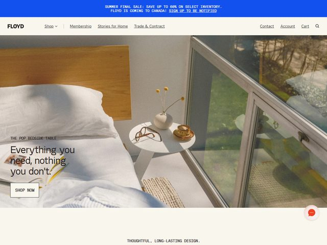

# Floyd — https://floydhome.com

- **niche:** home
- **mood:** warm-playful
- **style:** photographic, editorial, lifestyle, minimal
- **palette:** bg `#FFFFFF` · ink `#1A1A1A` · accent `#2C4BFF` — O azul cobalto elétrico fica isolado na barra de anúncio bem no topo ("SUMMER FINAL SALE… SIGN UP TO BE NOTIFIED"); o próprio hero não usa nenhuma cor de marca, apoiando-se inteiramente nos tons naturais e quentes da fotografia (madeira cor de mel, linho cor de aveia, verde ensolarado do lado de fora do vidro).
- **type:** display *sem serifa grotesca, próxima da Neue Haas / Helvetica Now, montagem apertada, peso levemente condensado* · body *mesma família, peso mais leve* — Direta e sem firulas, mais catálogo do que campanha; o wordmark "FLOYD" é caixa-alta chapada, sem nenhum floreio.
- **sections:** hero › category-tiles › bestsellers › modular-system-story › materials-sustainability › social-proof › cta › footer
- **signature:** A dobra inteira é uma única foto de quarto inundada de sol e sem estilização, fotografada num diagonal casual — uma cama desarrumada com linho branco amarrotado, uma pequena mesa de cabeceira segurando óculos de leitura, uma pilha de biscoitos e um vaso de haste única, ao lado de uma parede de janelas que dá para árvores. Se lê como uma manhã de verdade, não como um set montado; o produto (a mesa de cabeceira) está quase escondido entre a bagunça vivida em vez de iluminado como herói, e o texto fica pequeno no canto inferior esquerdo sobre a imagem em vez de num painel limpo.
- **imagery:** Fotografia editorial de lifestyle, full-bleed, luz natural do dia, ângulo espontâneo. Sem 3D, sem varredura de estúdio, sem foto recortada do produto no hero — o móvel é contextualizado dentro de uma casa real aspiracional-mas-crível, com estilização imperfeita.
- **copy:** Voz de produto quente, discreta, quase autodepreciativa. Eyebrow "THE POP BEDSIDE TABLE" em caixa-alta pequena espaçada, manchete "Everything you need, nothing you don't." com um botão contornado "SHOP NOW". Uma tagline centralizada no rodapé da dobra lê "THOUGHTFUL, LONG-LASTING DESIGN."

**Takeaways (roube como ideias, não copie):**
- Encene o hero como um momento crível de vida vivida (cama amarrotada, biscoitos pela metade, óculos deixados de lado) em vez de uma foto estéril de estúdio — a imperfeição sinaliza "casa de verdade, durabilidade de verdade".
- Enterre o produto no contexto em vez de iluminá-lo como herói; deixe o quarto vender o lifestyle e deixe a manchete nomear o SKU real num pequeno eyebrow.
- Mantenha a cor de destaque da marca totalmente fora do hero — confine o cobalto estridente a uma barra de anúncio utilitária para que os naturais quentes da fotografia carreguem todo o clima.
- Combine uma manchete humilde e antimaximalista ("Everything you need, nothing you don't.") com um pequeno botão contornado para se ler como honesta e editorial, não como vendedora.
