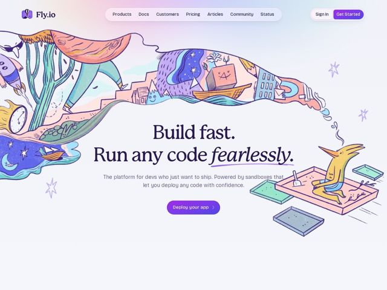

# Fly — https://fly.io

- **niche:** devops
- **mood:** warm-playful
- **style:** illustrated, colorful, gradient
- **palette:** bg `#F4F1FA` · ink `#3A2E5C` · accent `#6B4DE6` — Preenchimento do botão de CTA principal (Get Started, Deploy your app), o traço de sublinhado desenhado à mão sob 'fearlessly' e a própria palavra em script cursivo; reforçado por lavagens de lilás/violeta na ilustração e no gradiente da página.
- **type:** display *Uma serifa transicional de alto contraste (classe Times/Georgia) com um script swash itálico para a palavra enfatizada* · body *Uma sem serifa geométrica/humanista (Inter ou similar) para navegação, subtítulo e rótulos* — Livresca e editorial no topo, amigável e limpa abaixo — gravidade da serifa suavizada por um itálico manuscrito caprichoso
- **sections:** hero › feature-compute › feature-sandboxes › feature-storage › feature-networking › feature-vms › feature-fork › feature-distributed › feature-edge › feature-stack › feature-agents › logos › feature-enterprise › cta › footer
- **signature:** Um único mural de história em quadrinhos contínuo e desenhado à mão irrompe de trás do logo e flui por todo o hero como a cauda de um cometa de ideias — cogumelos, escadas, uma noite estrelada, uma caixa sorridente, uma raposa numa caixa de areia — de modo que a metáfora do produto (uma 'sandbox') é renderizada literalmente como um personagem brincando, em vez de um screenshot de UI.
- **imagery:** Ilustração editorial desenhada à mão: traços texturizados de lápis de cor/guache num registro de conto de fadas, assimétrica e full-bleed, com a arte envolvendo a manchete em vez de ficar ao lado dela. Sem screenshots de produto no hero; o conceito de 'sandbox' é visualizado como uma cena literal de animal-numa-caixa-de-areia no canto inferior direito.
- **copy:** Imperativo confiante em dois tempos com uma piscadela — afirmação declarativa curta mais um advérbio brincalhão. Manchete do hero: 'Build fast. Run any code fearlessly.' com 'fearlessly' em script itálico; subtítulo: 'The platform for devs who just want to ship.'

**Takeaways (roube como ideias, não copie):**
- Coloque a palavra do hero que carrega a emoção (aqui 'fearlessly') num script itálico contrastante com um sublinhado desenhado à mão — uma palavra vira a voz da marca e a única decoração de que a manchete precisa.
- Substitua o screenshot de dashboard por uma única ilustração panorâmica que literalmente encena sua metáfora central (sandbox = uma criatura brincando numa caixa de areia), para que visitantes de primeira viagem captem o conceito antes de ler uma palavra.
- Combine uma manchete em serifa transicional séria contra um corpo sem serifa limpo para sinalizar 'infraestrutura confiável' enquanto a ilustração carrega toda a brincadeira — gravidade e capricho divididos entre tipografia e arte.
- Mantenha o chrome quieto: navegação em pílula sobre uma lavagem lilás quase branca, um único destaque violeta saturado reservado apenas para CTAs e o sublinhado do hero, deixando a explosão de ilustração pastel se ler como quente, não barulhenta.
