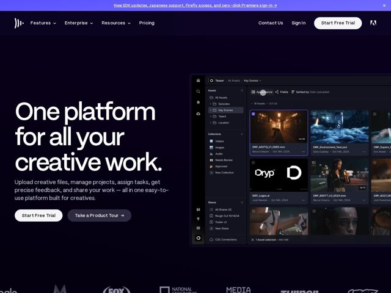

# Frame — https://frame.io

- **niche:** design
- **mood:** technical-dark
- **style:** dark, minimal, cinematic
- **palette:** bg `#100A1E` · ink `#FFFFFF` · accent `#5B4BFF` — gradiente da barra de anúncio no topo, a pílula principal 'Start Free Trial' e o anel de destaque do ativo selecionado dentro da UI do produto
- **type:** display *Sem serifa grotesca geométrica de montagem apertada (custom da Frame.io, na família Neue Haas Grotesk / Aktiv Grotesk)* · body *Mesma grotesca humanista em peso regular* — Confiante, superdimensionada, quase editorial — uma única fonte faz todo o trabalho, montada enorme e apertada no hero e arrematada com um ponto final para um tom declarativo, de ponto-final
- **sections:** announcement-bar › nav › hero › logos › feature-deliver-faster › feature-remove-blockers › metric-2.9x-faster › feature-upload-organize › metric-2.7x-review › feature-review-accuracy › metric-31pct-churn › feature-share-present › showcase-reinventing-workflows › pricing › cta › footer
- **signature:** O hero dá os ~55% direitos do canvas a uma UI de produto realista até o pixel e totalmente populada — um navegador escuro de ativos de vídeo lotado de stills reais de filme, nomes de arquivo, nomes de colaboradores e datas — em vez de um gradiente abstrato ou ilustração de hero, e a deixa sangrar para fora da borda direita para que a própria interface se torne a imagem.
- **imagery:** Stills cinematográficos de filme com clima sombrio (um corredor iluminado, uma foto de produto de garrafa, retratos em set) renderizados como thumbnails dentro de um dashboard escuro realista. Tudo é dessaturado para ficar contra o canvas quase preto, então a única cor vem da própria filmagem — a página toma emprestado o calor do trabalho criativo real em vez de gráficos decorativos.
- **copy:** Direta, com benefício em primeiro lugar e declarativa; o hero comprime todo o escopo numa linha — "One platform for all your creative work." — terminando num ponto final que transforma uma afirmação de funcionalidade num manifesto.

**Takeaways (roube como ideias, não copie):**
- Quantifique a proposta de valor literalmente nos títulos de seção — '2.9x faster workflows', '2.7x faster review', 'reduces churn by 31%' — alternando cabeçalhos de métrica com cabeçalhos de funcionalidade para que a página se leia como prova, não como pitch.
- Pontue a manchete do hero com um ponto final; o ponto reformula uma declaração de capacidade como uma afirmação confiante e adiciona voz de graça.
- Use a UI ao vivo do produto como arte do hero e deixe-a sangrar para fora do quadro, populada com dados de amostra críveis e on-brand (stills de filme, nomes de arquivo com som real, colaboradores, tamanhos de arquivo) para que se leia como uma sessão ativa, não como um mock estático.
- Mantenha a paleta em quase preto + branco + um único índigo elétrico, reservando o destaque para a barra de anúncio, o único CTA principal e o anel de seleção dentro do produto para que a cor sempre signifique 'aja aqui'.
