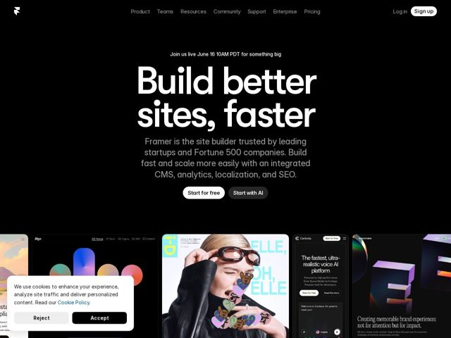

# Framer — https://framer.com

- **niche:** design
- **mood:** technical-dark
- **style:** dark, bento, mono-type
- **palette:** bg `#0A0A0A` · ink `#FFFFFF` · accent `#FFFFFF` — Invertido: o CTA principal 'Start for free' é uma pílula branca sólida com texto preto contra a página preta; o branco também é a tinta da manchete, então a ênfase vem da inversão de valor (pílulas branco-no-preto, subtexto esmaecido em cinza) em vez de um destaque cromático. A cor vive apenas dentro dos cards dos sites de clientes.
- **type:** display *Framer Sans (grotesca geométrica, provavelmente a fonte variável interna próxima da 'Inter')* · body *Mesma grotesca em peso regular, esmaecida para cinza* — Alta, apertada, confiante; espaçamento quase mono na navegação; hero superdimensionado em peso pesado para uma sensação suíça-técnica limpa
- **sections:** hero › feature-create-collaborate › feature-scale › feature-ai › feature-design › feature-cms › feature-collaborate › logos › testimonials › news › footer
- **signature:** O hero termina não com um screenshot estático, mas com uma fileira de sites de clientes reais e ao vivo espiando para cima a partir da dobra como cards de navegador superdimensionados — a Framer demonstra o produto mostrando o que as pessoas construíram com ele, transformando o hero numa vitrine viva que rola.
- **imagery:** Galeria de screenshots de produto: um carrossel horizontal sangrando nas bordas de sites reais de clientes (algo, editorial da ELLE, Cartesia voice-AI, estúdio de design) renderizados como cards de navegador flutuantes em preto puro — o próprio trabalho é a imagem, sem 3D abstrato ou fotografia genérica.
- **copy:** Manchete de promessa de resultado direta em tipografia massiva — hero real: "Build better sites, faster" — sustentada por subtexto de prova social nomeando "leading startups and Fortune 500 companies."

**Takeaways (roube como ideias, não copie):**
- Prove o produto com o produto: em vez de um único mockup de hero, faça um carrossel horizontal de sites REAIS de clientes sangrar para fora das duas bordas para que a própria dobra seja a demo — credibilidade através de artefatos, não de afirmações.
- Vá totalmente acromático e deixe a ênfase vir da inversão: página preto puro, pílula de CTA branca sólida, subtexto esmaecido em cinza. Guarde toda cor saturada para dentro dos cards da vitrine, para que o trabalho do cliente seja a única coisa que se destaca.
- Monte a manchete do hero enorme (≈9-10rem) numa grotesca geométrica pesada, duas linhas apertadas centralizadas, com uma quebra de vírgula ('Build better sites, faster') para adicionar cadência — a tipografia faz o trabalho de design, sem nenhum gráfico necessário.
- Combine uma única manchete de benefício com uma sublinha de prova de uma frase que cita o nível de cliente ('leading startups and Fortune 500 companies') — autoridade concreta vence adjetivos.
