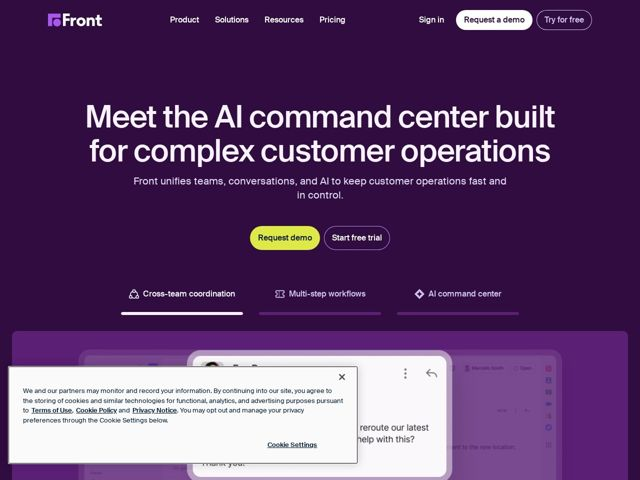

# Front — https://front.com

- **niche:** customer-service / CX platform (dev-adjacent ops, AI-powered support)
- **mood:** technical-dark
- **style:** dark, gradient, bold
- **palette:** bg `#2A1245` · ink `#FFFFFF` · accent `#E6FF4F` — primary CTA pill (Request demo), highest-contrast call-to-action; secondary CTA is a thin lilac-outlined ghost button
- **type:** display *Grotesque/geometric sans (heavy weight, tight tracking — likely a custom or GT-America/Aeonik-style grotesk)* · body *Same humanist-grotesk family at regular weight* — Confident and editorial — oversized headline dominates the viewport, almost magazine-cover scale, calm authority rather than playful
- **sections:** hero › feature-cross-team › logos › feature-unify-stack › problem › feature-one-view › feature-ai › feature-resolution › how-it-works › industries › cta › footer
- **signature:** A near-black aubergine/violet field used as the ENTIRE hero canvas with a single acid-lime pill CTA — the niche (helpdesk/CX) almost universally ships clean-light, blue-accented, friendly pages; Front goes dark-luxe and punches one toxic-yellow button as the only color event on screen.
- **imagery:** Real product UI rendered as layered, rounded-corner glass cards (inbox conversation, sidebar app rail, status chips like "Open"/"Marcello Smith") floating on the violet ground with soft purple glow; tab-switcher above the screenshot (Cross-team coordination / Multi-step workflows / AI command center) implies the hero image swaps per tab. Product-as-hero, no stock photography or abstract 3D.
- **copy:** Combative, category-defining voice that names the enemy ("AI for simple support is everywhere. Complex customer operations demand Front." / hero render reads "Meet the AI command center built for complex customer operations") — confrontational headlines like "Alt+Tab isn't a workflow."

**Takeaways (steal as ideas, don't copy):**
- Anchor a dark page on ONE saturated accent (acid lime on aubergine) used solely for the primary CTA — color becomes the click instruction, not decoration.
- Set the H1 at near-poster scale (~80px) so the headline alone fills the first viewport; the subhead and dual CTAs stay quiet beneath it.
- Put a tabbed sub-nav directly under the hero copy (with tiny line-icons + progress underlines) to preview multiple product angles without leaving the fold.
- Write headlines that name the rival behavior you replace ('Alt+Tab isn't a workflow', 'AI for simple support is everywhere') — positioning as copy, not feature lists.
