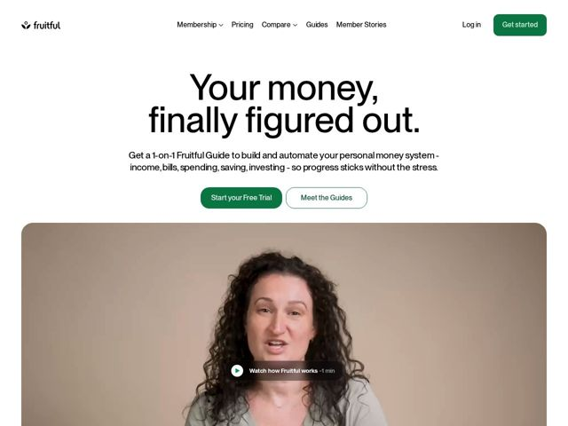

# Fruitful — https://fruitful.com

- **niche:** fintech
- **mood:** clean-light
- **style:** minimal, photographic, editorial-minimal
- **palette:** bg `#FFFFFF` · ink `#1A1A1A` · accent `#0F7A4D` — botões de CTA primário (verde preenchido + ghost com contorno verde), o logo, o botão de play e os links inline
- **type:** display *Grotesca sem serifa (estilo Aktiv/Founders-Grotesk), tracking apertado, peso quase preto em escala enorme* · body *Mesma grotesca humanista, peso regular, tamanho generoso* — Calorosa, confiante e humana; o display centralizado em tamanho gigante soa editorial e tranquilizador, em vez do fintech corporativo e polido de praxe
- **sections:** hero › logos › feature-financial-world › how-it-works › feature-system › testimonials › pricing › cta › faq › footer
- **signature:** Um vídeo full-bleed de um Guia real falando à câmera (uma pessoa, não um dashboard) ancora o hero — fintech quase nunca abre com um rosto humano sobre a UI do produto; aqui o humano É o produto, sinalizando coaching 1-a-1 acima de software.
- **imagery:** Vídeo cinematográfico de retrato espontâneo, com luz quente, fundo bege/tom de pele suave e um selo em relevo "Watch how Fruitful works -1 min". Estética people-first, com toque documental — nenhum gráfico, tela de app ou abstração 3D no hero.
- **copy:** Promessa de resultado tranquilizadora e direta, que nomeia a dor do usuário — hero: "Your money, finally figured out."

**Takeaways (roube como ideias, não copie):**
- Abra com um rosto humano em vídeo em vez da UI do produto quando o diferencial for uma pessoa/serviço, não as features — reenquadra a categoria inteira
- Combine um CTA preenchido na cor de destaque com um CTA ghost de contorno na mesma família de verde, para que ambos pareçam da marca e ainda fiquem claramente primário/secundário
- Coloque o headline display enorme e centralizado, com tracking apertado, e baixe a copy de apoio para um corpo calmo — deixe a escala sozinha carregar o peso emocional
- Use um enquadramento de verbo de 'estado final' ('finally figured out') para vender a sensação posterior, não o mecanismo
