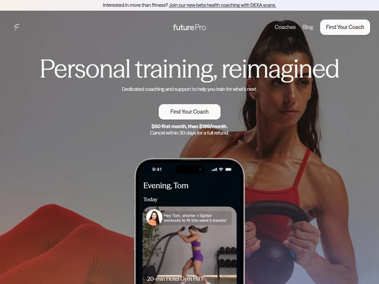

# futurePro — https://www.future.co

- **niche:** fitness
- **mood:** premium-luxe
- **style:** photographic, editorial, app-ui, cinematic
- **palette:** bg `#8A8786` · ink `#F4F2F0` · accent `#C0392B` — There is no marketing-color accent; the only saturated note is the warm rust-red of the athlete's sports bra and the sculpted red dune in the lower-left, which the muted gray-fog photo isolates. White does all the UI work (pill CTA, wordmark, copy).
- **type:** display *editorial high-contrast serif, Canela / Tiempos Headline vein, set huge with an italic swash on "reimagined"* · body *humanist sans, Söhne / Inter, light weight, letter-spaced eyebrow* — Confident, expensive, magazine-cover voice; the lone italic word adds editorial warmth to an otherwise clean grotesque body.
- **sections:** hero › how-it-works › meet-the-coaches › app-features › results-testimonials › pricing › cta › footer
- **signature:** A real iPhone mock floats half-out of the fold, screen lit with an actual coach-chat thread ("Evening, Tom" / "Hey Tom, shorter + lighter workouts to fit this week's travels!" / "20-min Hotel Gym HIIT") — the product proof is a personalized human message, not a feature grid. It's staged over a full-bleed, desaturated photo of a focused athlete mid kettlebell-hold, so the warm phone UI is the one bright object in a cool gray frame.
- **imagery:** Full-bleed cinematic photography, heavily desaturated to a foggy gray so a single warm accent (red bra, red dune) survives; a high-fidelity product-UI phone composited on top. Photo + real app screen, zero illustration or 3D.
- **copy:** Aspirational editorial register. Headline "Personal training, reimagined" (with "reimagined" in italic serif), subhead "Dedicated coaching and support to help you train for what's next.", a slim top banner "Interested in more than fitness? Join our new beta health coaching with DEXA scans." and below the CTA the de-risking line "$50 first month, then $199/month. Cancel within 30 days for a full refund."

**Takeaways (steal as ideas, don't copy):**
- Desaturate the hero photo almost to grayscale so one naturally warm element (a red garment, a dune) becomes a free accent — no brand color needed.
- Prove the product with a real, personalized message thread in a floating phone, not a feature list — the human coach copy ("shorter + lighter workouts to fit this week's travels") is the selling point.
- Italicize a single word of an editorial serif headline ("reimagined") to inject voice without busying the type.
- Park price + refund terms directly under the CTA ("$50 first month… Cancel within 30 days") to kill objection at the point of click.
