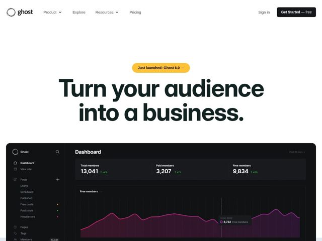

# Ghost — https://ghost.org

- **niche:** dev-tools
- **mood:** clean-light
- **style:** minimal, mono-type, photographic
- **palette:** bg `#FFFFFF` · ink `#15212A` · accent `#FFC107` — the 'Just launched: Ghost 6.0' pill badge above the hero headline; also surfaces in product UI accents (magenta chart line in the embedded dashboard)
- **type:** display *Inter Display (InterVariable, very heavy weight)* · body *Inter* — Confident, oversized, near-black headline in a tight ultra-bold grotesque — editorial heft meets startup sans. The single typeface family doing both display and body reads as engineered and self-assured.
- **sections:** hero › feature-easy-site-design › feature-advanced-creator-tools › feature-grow-audiences › feature-run-business › feature-integrations › testimonials-publishers › testimonials-creators › testimonials-businesses › feature-built-to-last › cta-launch › footer
- **signature:** The hero is almost entirely empty white space wrapped around one enormous dark grotesque headline, then anchored by a pixel-accurate, dark-mode product dashboard screenshot that bleeds off the bottom edge — letting the real app, not decoration, become the visual hero. The light/dark contrast (airy white headline zone crashing into a near-black UI screenshot) breaks the all-light-or-all-dark convention of the category.
- **imagery:** Real product UI as the primary image: a high-fidelity, dark-themed admin dashboard (member stats, a glowing magenta analytics area chart) shown full-bleed and slightly cropped so it feels like a live window. No illustrations, no abstract gradients, no stock photos — just the actual product and, lower down, real publisher logos/portraits as social proof.
- **copy:** Outcome-driven, plain-spoken promise — names the result, not the tool. Hero: "Turn your audience into a business."

**Takeaways (steal as ideas, don't copy):**
- Let one giant tight-tracked grotesque headline carry the entire hero on near-empty white space — scale is the whole design, no supporting graphic needed.
- Use a single warm-yellow pill ('Just launched: Ghost 6.0 →') as the ONLY chromatic accent in an otherwise black-on-white hero, so the eye lands on the announcement first.
- Anchor the hero with a full-bleed, cropped real product screenshot in dark mode — the white-to-near-black handoff creates drama and proves the product in one scroll.
- Structure the body as outcome-named feature buckets (Grow your audiences, Run your business) then triple-segment social proof (Publishers / Creators / Businesses) so each visitor sees their own use case.
