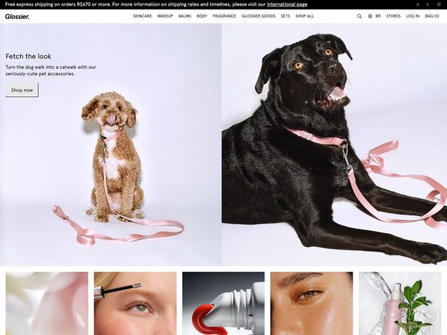

# Glossier — https://www.glossier.com

- **niche:** beauty
- **mood:** clean-light
- **style:** minimal, photographic, editorial
- **palette:** bg `#F4F4F4` · ink `#1A1A1A` · accent `#F4A6B8` — The signature millennial-pink shows up only inside the photography (the dog leashes), never on chrome or buttons; the UI itself is monochrome black-on-near-white, so the pink reads as a styling cue rather than a brand swatch painted on.
- **type:** display *grotesque sans, Glossier's custom Glossier Sans / National 2-style face, plain weight* · body *same neutral grotesque at small size, generous tracking* — Quiet, lowercase-feeling, drugstore-clean; the typography deliberately stays out of the way of the skin and product.
- **sections:** hero › category-tiles › bestsellers-grid › shade-finder › editorial-story › ugc-grid › cta › footer
- **signature:** The hero is split into two near-full-height photo panels of dogs — a curly apricot doodle and a black lab — each modeling a pink Glossier-branded pet leash against the same flat off-white seamless used for the beauty shots. A skincare brand puts zero product and zero face in the fold and instead leads with pets as the lifestyle prop; the only "product" visible above the fold is an accessory worn by an animal.
- **imagery:** Studio photography on a single seamless light-gray backdrop, soft and shadow-light, color-corrected to that powdery Glossier neutral. Below the fold a strip of square crops (a glossy balm, mascara on a lash, a red gloss wand, dewy under-eye skin, a serum dropper) reads as the real beauty grid — wet-look, macro, skin-forward, no illustration or 3D anywhere.
- **copy:** Casual, lower-stakes, almost conversational. Headline 'Fetch the look', subhead 'Turn the dog walk into a catwalk with our seriously-cute pet accessories.', CTA 'Shop now'. A thin black promo bar runs across the top: 'Free express shipping on orders R$670 or more. For more information on shipping rates and timelines, please visit our international page'.

**Takeaways (steal as ideas, don't copy):**
- Stage the hero on one continuous seamless backdrop and let the product's accent color live only inside the photo, never on the UI chrome — the page reads cleaner and the color feels earned.
- Lead the fold with an unexpected lifestyle subject (here, pets) instead of the product or a model face; the surprise does the work a louder layout usually has to.
- Split the hero into two equal photographic panels with a single short headline overlaid on the left — gives editorial rhythm without a hero "block" of marketing text.
- Keep all chrome monochrome (black wordmark, black nav, plain bordered "Shop now" button) so the photography carries 100% of the brand mood.
