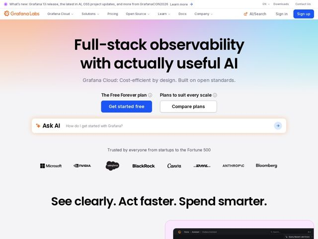

# Grafana — https://grafana.com

- **niche:** dev-tools / observability
- **mood:** clean-light
- **style:** minimal, gradient, mono-type
- **palette:** bg `#FFFFFF` · ink `#0A0A0A` · accent `#3B6BF6` — primary CTA button (Get started free) and Sign up button; Grafana orange logo mark used sparingly; the hero band sits on a soft peach-to-lilac-to-sky horizontal gradient wash
- **type:** display *Inter (tight, heavy weight — likely a geometric grotesque such as Inter/Roboto-style sans)* · body *Inter (same family, regular weight)* — Loud, oversized, ultra-tight-tracked black-weight headlines that feel almost editorial/poster-like; the supporting copy reverts to calm neutral grotesque. The contrast between giant ink-black display and quiet gray body is the whole voice.
- **sections:** nav › announcement-bar › hero › dual-cta › ask-ai-prompt › logos › feature-intro-heading › feature-product-screenshot
- **signature:** An embedded "Ask AI" prompt bar sitting directly under the hero CTAs — a live conversational input ('How do I get started with Grafana?') framed as a soft-glowing pill, turning the landing page itself into the product's AI surface instead of the usual static 'Book a demo' row.
- **imagery:** Very little decorative imagery up top — the hero is pure oversized type on a pastel gradient field. Trust is carried by monochrome grayscale customer wordmarks (Microsoft, NVIDIA, Salesforce, BlackRock, Canva, DHL, Anthropic, Bloomberg) in a flat single row. Below the fold, a real dark-mode product dashboard screenshot floats in a rounded card with a pink/lilac glow halo — the only place color and UI texture appear, deliberately contrasting the airy white scroll above it.
- **copy:** Plain-spoken, slightly cheeky confidence — hero reads "Full-stack observability with actually useful AI" with subhead "Grafana Cloud: Cost-efficient by design. Built on open standards." and a section header "See clearly. Act faster. Spend smarter."

**Takeaways (steal as ideas, don't copy):**
- Put a working AI prompt bar in the hero (not a screenshot of one) — make the page the first touch of the product, with a placeholder question that demonstrates intent.
- Dual labeled CTAs: instead of one button, frame two paths with micro-headers above them ('The Free Forever plan' / 'Plans to suit every scale') so the choice itself does selling.
- Let oversized ink-black tight-tracked type carry the entire hero on a quiet pastel gradient — no illustration needed; the typographic scale IS the visual.
- Inject a self-aware word like 'actually useful AI' into the headline to signal you know the category is saturated with hype — earns trust through honesty.
