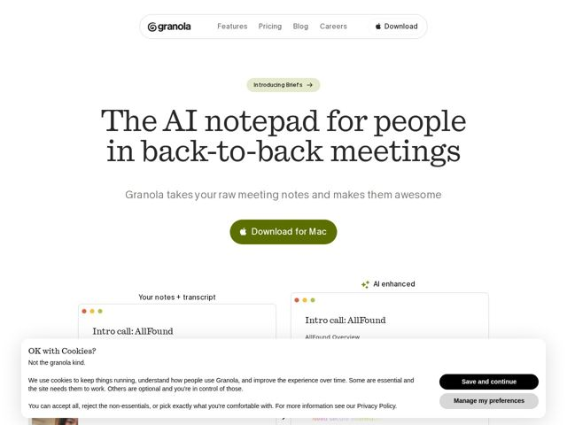

# Granola — https://granola.ai

- **niche:** productivity
- **mood:** warm-playful
- **style:** minimal, mono-type, illustrated
- **palette:** bg `#FAF9F6` · ink `#2B2B28` · accent `#5C6B1E` — preenchimento do CTA primário 'Download for Mac' (verde-oliva tipo granola), ícones de brilho/ponto, links e destaques de selos
- **type:** display *Serifa transicional de alto contraste (tipo Tiempos)* · body *Sans grotesca geométrica (tipo Aktiv Grotesk)* — Headline em serifa editorial e livresca sobre uma sans utilitária e limpa — lê-se como um caderno inteligente, não como um dashboard. Caloroso, letrado, calmo.
- **sections:** hero › logos › how-it-works › feature-transcribe › feature-enhance › feature-platforms › feature-templates › feature-integrations › feature-share › testimonials › cta › footer
- **signature:** O hero é um díptico literal de antes/depois da própria saída do produto — "Your notes + transcript" (cru) ao lado de "AI enhanced" (polido) — para que o produto faça sua própria demo em vez de um gráfico de hero estilizado fazer a conversa.
- **imagery:** Cards de janela de nota skeumórficos, com os pontinhos de semáforo do macOS e títulos em serifa por dentro — a UI imita papel/Apple Notes. Headshots reais nos depoimentos, pequenos motivos de brilho/ponto. A imagem É a superfície do produto, não um 3D abstrato.
- **copy:** Simples, humana, levemente espirituosa ("Not the granola kind."); o hero abre com a dor do usuário, não com a tecnologia: "The AI notepad for people in back-to-back meetings"

**Takeaways (roube como ideias, não copie):**
- Abra com um díptico literal de antes/depois da própria saída do seu produto em vez de uma ilustração de hero — deixe o artefato ser o pitch.
- Combine um headline em serifa editorial de alto contraste com um corpo em sans neutra sobre uma tela de papel off-white quente (#FAF9F6) para se ler como 'ferramenta pensada', não 'startup de tech'.
- Tome emprestada a casca de um app de desktop (pontinhos de semáforo do macOS, molduras de janela) como sistema de imagem, para que os screenshots pareçam nativos e confiáveis.
- Escolha um destaque inesperado, derivado de comida (verde-oliva 'granola'), que se conecte ao nome da marca e permaneça quente — evite o azul/roxo padrão de SaaS.
