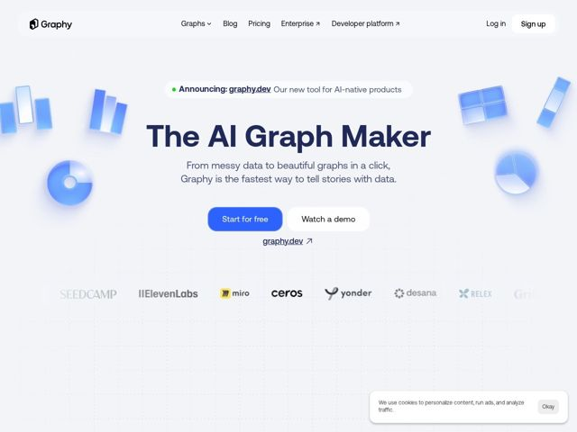

# Graphy — https://graphy.app

- **niche:** data (data-viz / charting tool)
- **mood:** clean-light
- **style:** minimal, 3d, colorful
- **palette:** bg `#EEF1F6` · ink `#1E2A52` · accent `#3B6FF6` — primary CTA button fill, hero link underline, and the floating glassy chart objects (bars, pie, donut, grid) scattered around the headline
- **type:** display *Rounded grotesque (geometric sans with rounded terminals, similar to a bespoke/SF Rounded or Hellix-style face)* · body *Same rounded sans family at regular weight* — Friendly, soft, confident — the rounded letterforms make a data tool feel approachable rather than clinical or enterprise-cold
- **sections:** hero › logos › feature-grid (chart-type gallery: bar, line, funnel, table, pie, heatmap, donut, etc.) › problem (Benefits of data storytelling) › footer
- **signature:** The hero headline floats inside a constellation of translucent, frosted-glass 3D chart fragments (a half-pie, glassy bar clusters, a window grid, a donut) that hover at the page edges like physical objects on a light table — turning abstract "graphs" into tactile, almost-touchable glass props instead of the usual flat dashboard screenshot.
- **imagery:** Frosted-glass / glassmorphism 3D renders of chart primitives (bars, pie, donut, grid panels) in soft blue gradients with realistic blur, refraction and drop shadows. They sit on a near-white grid-dotted canvas, used as decorative scaffolding around the headline rather than as a product UI screenshot. Logo row is a desaturated greyscale ribbon.
- **copy:** Plainspoken benefit-first promise with a transformation arc — hero: "The AI Graph Maker" / subhead "From messy data to beautiful graphs in a click, Graphy is the fastest way to tell stories with data."

**Takeaways (steal as ideas, don't copy):**
- Render your product's core noun (here: charts) as floating frosted-glass 3D objects and scatter them around the headline as decor — gives a flat utility category instant physicality and premium feel without a UI screenshot
- Use a faint dotted-grid canvas in near-white to subtly evoke graph paper / a plotting surface, reinforcing the category while staying airy and minimal
- Pair a deep navy ink with a single saturated blue accent on a cool off-white bg — keeps it clean and trustworthy while letting one CTA + the glass props own all the color
- Lean on rounded grotesque letterforms to make a technical data tool feel friendly and human, countering the usual cold enterprise-analytics vibe
