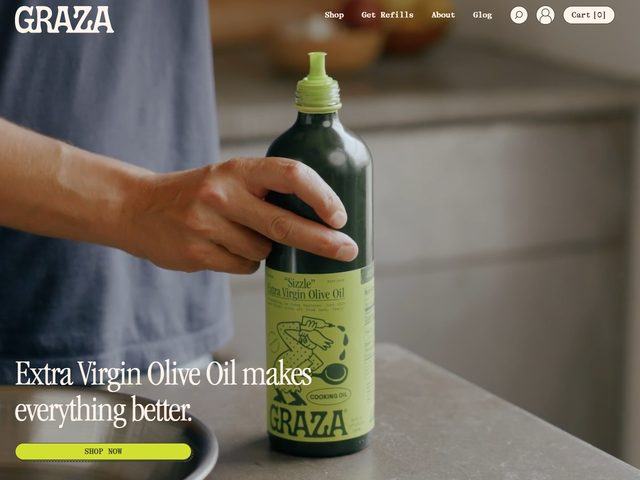

# GRAZA — https://www.graza.co

- **niche:** food
- **mood:** warm-playful
- **style:** photographic, lifestyle, retro-grocery, bold
- **palette:** bg `#A8AFA6` · ink `#1F2A18` · accent `#C7E04A` — The chartreuse lime-green is pulled straight from the olive-oil bottle's cap and label, then echoed in the pill-shaped "SHOP NOW" button at the bottom-left; it's the single saturated note against a muted greige kitchen scene.
- **type:** display *editorial italic serif (Caslon / Freight Big style, lowercase, slight slant)* · body *small caps geometric sans for nav (Maison Neue / GT America)* — Warm, conversational, kitchen-table; the serif italic feels like a recipe card handwritten by a friend.
- **sections:** hero › why-squeeze-bottle › drizzle-vs-sizzle-product-split › ingredients-sourcing › reviews › refills-subscription › cta › footer
- **signature:** A real, candid kitchen photo — a hand squeezing the iconic dark-green Graza bottle with the bright lime spout — IS the hero, shot on a concrete countertop with shallow depth of field, not a sterile studio packshot. The product label itself carries hand-drawn illustration ("Sizzle" Extra Virgin Olive Oil, a little doodled figure) so the packaging does double duty as the brand's visual voice. The whole frame reads like a still from a cooking moment, not an ad.
- **imagery:** Lifestyle product photography — warm, slightly desaturated, naturalistic kitchen light, human hand in frame for scale and intimacy. The squeeze bottle is the hero object; no 3D, no illustration except what lives printed on the label.
- **copy:** Plainspoken and cheeky-confident. Headline in lowercase italic serif: "Extra Virgin Olive Oil makes everything better." Bottle label copy visible: "Sizzle" / Extra Virgin Olive Oil / "COOKING OIL" / GRAZA. CTA pill reads "SHOP NOW".

**Takeaways (steal as ideas, don't copy):**
- Make a candid in-use photo (a hand squeezing the bottle) the hero instead of a clean packshot — it sells the ritual, not just the SKU.
- Pull your one accent color directly out of the physical product (the cap/label green) so the brand and the package feel like one object.
- Put hand-drawn illustration ON the packaging, then let the photographed package carry that personality into the hero — no separate illustration system needed.
- Set the headline in a lowercase italic serif over a muted greige scene so the single saturated CTA pill pops without any extra contrast tricks.
