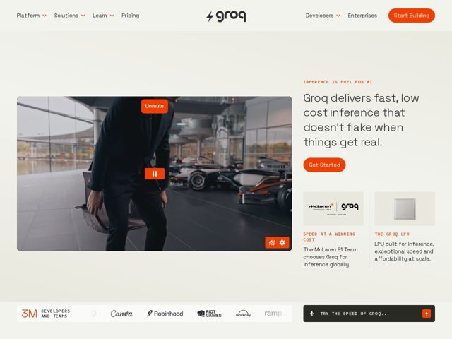

# Groq — https://groq.com

- **niche:** ai (AI inference infrastructure / dev-tools)
- **mood:** clean-light
- **style:** minimal, mono-type, cinematic
- **palette:** bg `#EDEAE6` · ink `#1A1A1A` · accent `#F55036` — rótulos eyebrow, botões de CTA primário (Start Building / Get Started), controles de vídeo, o ícone de enviar da barra de busca e o logo do raio
- **type:** display *Grotesca geométrica com sensação de baixo contraste e toque mono (a sans de marca/sob medida da Groq, próxima de uma grotesca humanista como Neue Montreal / GT America)* · body *Sans monoespaçada para eyebrows e microcopy (rótulos em caixa-alta com letter-spacing); grotesca proporcional para os parágrafos de corpo* — Engenhosa, objetiva, confiante — lê-se como uma ficha técnica que aprendeu a falar de forma simples
- **sections:** hero › feature-mclaren-proof › feature-lpu › logos › problem-different-stack › feature-custom-silicon › how-it-works-deployed-worldwide › testimonials-devs-trust › feature-mclaren-detail › testimonials-proof › feature-code-snippet › featured-news › cta-build-fast › footer
- **signature:** O hero abre com um vídeo cinematográfico de paddock de F1 ao vivo e com autoplay (com chrome de Unmute/Pause/configurações) em vez do obrigatório screenshot de produto de IA, terminal ou gradiente abstrato — vende velocidade de inferência através do movimento do automobilismo, não de um dashboard.
- **imagery:** Footage e fotografia do mundo real, em estilo documental (garagem da McLaren na F1, carro de corrida, engenheiro de terno) mais uma foto física e limpa do chip LPU sobre um cinza-papel quente. Sem abstrações 3D ou clichês de IA; logos de parceiros em monocromático. O laranja de destaque amarra a marca à paleta de corrida da McLaren.
- **copy:** Fala de engenheiro direta e anti-hype, com gingado — hero: "Groq delivers fast, low cost inference that doesn't flake when things get real."

**Takeaways (roube como ideias, não copie):**
- Substitua o screenshot padrão de hero de IA por movimento que encarne fisicamente sua proposta de valor (velocidade = vídeo de automobilismo) — deixe o meio argumentar o benefício
- Combine um fundo de papel off-white quente com um único destaque quente (laranja de corrida) para que CTAs e rótulos eyebrow saltem sem nenhum gradiente
- Use eyebrows monoespaçados em caixa-alta com letter-spacing ('INFERENCE IS FUEL FOR AI') como sinalizações de seção para telegrafar uma voz técnica de ficha técnica
- Ancore a credibilidade com uma grade de prova lado a lado: um cliente-carro-chefe nomeado (McLaren F1) ao lado de um artefato tangível do produto (o chip LPU)
