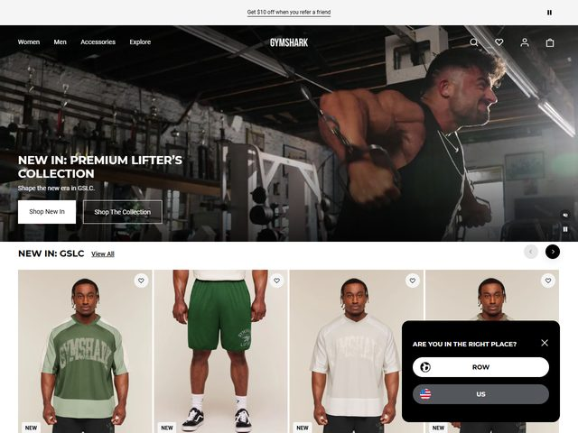

# Gymshark — https://www.gymshark.com

- **niche:** fitness
- **mood:** bold-loud
- **style:** photographic, gritty, athletic, editorial
- **palette:** bg `#1C1E1A` · ink `#F4F2EC` · accent `#3E5A36` — There's almost no UI accent color; the "accent" is the muted olive/forest green that lives inside the photography itself (the model's tank, the apparel grid) rather than in chrome. Buttons are stark black/white pills, so the green only ever appears as product, never as decoration.
- **type:** display *condensed grotesque, all-caps, heavy (think a tightened Druk Condensed / National 2 Condensed)* · body *humanist sans, small and quiet (Inter / Suisse-like)* — Gym-poster shout in the headline, calm whisper in the support line.
- **sections:** hero › new-in-product-rail › category-grid (men/women/accessories) › lookbook-editorial › athlete-community › cta › footer
- **signature:** The hero is a single full-bleed, grainy gym-floor photograph — a real lifter mid-set on a cable machine in a dim industrial weight room — with the headline burned directly into the bottom-left of the image, no card, no scrim panel. It reads like a film still, not a banner. Immediately below, the fold breaks into a horizontally-scrollable product rail of four head-to-toe model shots ("NEW IN: GSLC · View All"), so the page goes from cinematic mood to shoppable catalog in one scroll without a section seam.
- **imagery:** Photo-led throughout. Hero is a desaturated, available-light gym photograph (warm tungsten, deep shadows, visible grain) staged for atmosphere over clarity. The product rail switches to clean, evenly-lit studio-floor full-body shots on a pale neutral backdrop — same models, consistent crop, each tagged with a small "NEW" chip and a heart/save icon.
- **copy:** Confident, lifestyle-catalog voice. Headline: "NEW IN: PREMIUM LIFTER'S COLLECTION" with eyebrow-style subhead "Shape the new era in GSLC." Top utility bar promos "Get $10 off when you refer a friend"; rail is labelled "NEW IN: GSLC".

**Takeaways (steal as ideas, don't copy):**
- Set the headline directly onto a full-bleed atmospheric photo with no scrim or card — let the natural dark corner of the image be the contrast, so type and image read as one frame.
- Use a condensed all-caps heavy display for the shout line and pair it with a tiny humanist support line — the size/weight gap does all the hierarchy work.
- Transition from a cinematic mood hero into a shoppable horizontal product rail within the first scroll, labelled with a product acronym + "View All", so vibe converts to catalog instantly.
- Keep buttons monochrome (black + white pills) and let the only color enter through the product photography itself — the brand reads premium because nothing competes with the apparel.
