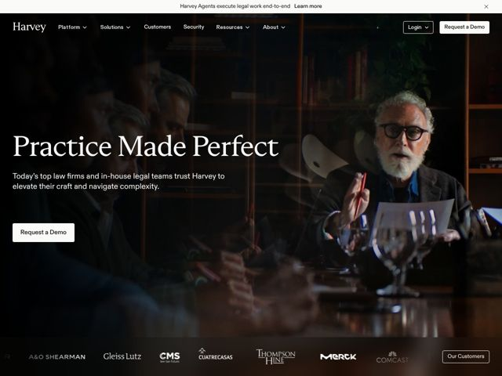

# Harvey — https://harvey.ai

- **niche:** legal
- **mood:** premium-luxe
- **style:** dark, photographic, mono-type
- **palette:** bg `#0E0B08` · ink `#F2EFEA` · accent `#B5651D` — Não é uma cor saturada de UI — o 'destaque' é o brilho âmbar/conhaque quente embutido na fotografia (uísque, couro, madeira de biblioteca à luz de abajur). Nunca aparece como preenchimento de botão ou link; todo o calor da marca vive dentro da imagem, enquanto o chrome da UI permanece neutro, branco-sobre-quase-preto.
- **type:** display *GT Super (ou uma serifa de alto contraste próxima da Didone, como Canela/Tiempos Headline)* · body *Neue Haas Grotesk / uma grotesca sans neutra e limpa* — Headline em serifa editorial de dinheiro antigo encontra uma sans suíça silenciosa — gravidade de quem passou na OAB, zero brincadeira de startup
- **sections:** hero › logos › feature-overview › feature-assistant › feature-vault › feature-knowledge › feature-agents › feature-mobile › feature-ecosystem › feature-contract-intelligence › feature-command-center › feature-shared-spaces › how-it-works › problem-by-segment › testimonials › resources › cta › footer
- **signature:** O hero é uma fotografia cinematográfica e mal iluminada de um sócio sênior distinto, de barba grisalha, deliberando sobre papéis numa biblioteca de couro e mogno — um humano real numa sala de reuniões real, não uma UI de produto. Uma empresa de IA escolheu abrir com o *ofício da advocacia* em vez de um dashboard, e deixou o headline em serifa flutuar no espaço negativo escuro à esquerda, onde a foto cai para o preto.
- **imagery:** Fotografia cinematográfica, com color grading escuro e quente (luz-chave âmbar contra sombra profunda), com uma sutil sobreposição de vidro/reflexo dispondo em camadas várias figuras ao redor de uma mesa de reunião. Tratada como um still de filme ou uma campanha de marca de prestígio, não como um hero de SaaS. Screenshots de produto são totalmente adiados para baixo da dobra; o topo da página é puro clima.
- **copy:** Aforismo aspiracional de duas palavras em serifa sobre uma copy de confiança e direta — o hero diz 'Practice Made Perfect', subtítulo: 'Today's top law firms and in-house legal teams trust Harvey to elevate their craft and navigate complexity.' Voz = confiante, discreta, de profissional-de-elite para par.

**Takeaways (roube como ideias, não copie):**
- Abra com o ofício do cliente, não com sua UI: para uma ferramenta B2B premium, uma foto cinematográfica do profissional em ação vende mais do que um screenshot de dashboard — adie todas as fotos de produto para baixo da dobra.
- Construa o destaque DENTRO da fotografia: em vez de uma cor saturada de botão, faça o color grading do hero em tom quente (âmbar/conhaque contra quase preto) para que a marca tenha uma temperatura sem um único elemento colorido de UI.
- Ancore o headline no lado escuro da foto: fotografe/corte de modo que uma metade caia para o preto, depois componha uma serifa Didone de alto contraste nesse espaço negativo — sem precisar de caixa de scrim.
- Combine um headline em serifa editorial de dinheiro antigo com um corpo em grotesca neutra para sinalizar 'instituição estabelecida' em vez de 'startup de tech' — o próprio contraste de tipo faz o trabalho de posicionamento.
- Rode a barra de logos de clientes como uma faixa silenciosa em escala de cinza logo abaixo do hero (escritórios de advocacia nomeados + Merck/Comcast) para que a prova social chegue antes de qualquer alegação de feature.
