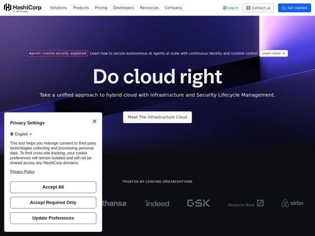

# Hashicorp — https://hashicorp.com

- **niche:** devops
- **mood:** technical-dark
- **style:** dark, gradient, minimal, cinematic
- **palette:** bg `#1B0E3D` · ink `#FFFFFF` · accent `#C9A8FF` — diagonal light-leak/prism streak across the hero, the announcement pill border, and the soft pink-violet glow bleeding from the top-right corner
- **type:** display *serif (high-contrast transitional, e.g. a Tiempos/Times-like face)* · body *humanist sans-serif (geometric-leaning, e.g. an Inter/HashiCorp-system sans)* — an old-world serif headline against clean infra-sans body — gravitas meets engineering precision
- **sections:** nav › hero › logos
- **signature:** A giant editorial SERIF headline ('Do cloud right') in a category where every competitor defaults to bold geometric sans — pairing literary gravitas with a dark prism-lit infrastructure backdrop instead of the usual diagram screenshot.
- **imagery:** No product screenshots or 3D diagrams above the fold. The hero is pure atmosphere: a deep indigo-to-black field cut by a single razor-sharp diagonal light beam and a soft pink/violet prism bloom in the top corner — abstract 'computational light' rather than literal infrastructure. Customer logos rendered in flat monochrome grey for restraint.
- **copy:** Confident three-word imperative as hero ('Do cloud right'), backed by a precise enterprise subhead — declarative, authoritative, zero hype. Announcement pill ('Agentic runtime security, explained') ties the brand to the AI moment.

**Takeaways (steal as ideas, don't copy):**
- Break category convention with type: a high-contrast editorial serif headline reads as premium and human in a sea of dev-tool geometric sans.
- Replace the obligatory product screenshot with atmosphere — one sharp diagonal light beam + a corner prism glow carries the whole hero and keeps focus on the words.
- Anchor the hero with a tiny pill-shaped announcement banner above the headline to surface a timely topic (AI/agentic security) without cluttering the main message.
- Keep enterprise trust signals quiet: logo wall in flat monochrome grey under an all-caps 'TRUSTED BY' label lets it recede until you look for it.
