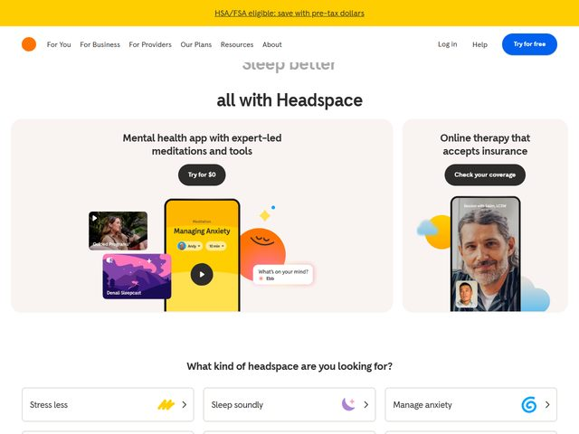

# Headspace — https://www.headspace.com

- **niche:** health
- **mood:** warm-playful
- **style:** rounded, friendly, photographic, app-led
- **palette:** bg `#FFFFFF` · ink `#2B2B2B` · accent `#FFCD2B` — A sunny amber-yellow does the heavy lifting: it tops the page as a full-width HSA/FSA promo bar, fills the in-app meditation screen ("Managing Anxiety"), and reappears as the icon glyph in the "Stress less" card. The primary CTA pill, by contrast, is a saturated `#1973E8` blue ("Try for free"), so yellow stays the brand mood while blue owns the click.
- **type:** display *geometric humanist sans, rounded terminals (Headspace's own "Apercu"-like / Söhne-adjacent face)* · body *same family, lighter weight, soft gray* — Approachable and un-clinical; the rounded letterforms read warm, never medical.
- **sections:** hero › what-kind-of-headspace (category cards) › app-features › therapy-&-coaching › evidence/science › testimonials › plans-&-pricing › cta › footer
- **signature:** The hero abandons a single big visual for a TWO-CARD split offer on a peach (`#FBF0EC`) panel — left card sells the self-serve app ("Mental health app with expert-led meditations and tools") with a cluster of tilted, overlapping app screens and podcast thumbnails; right card sells human care ("Online therapy that accepts insurance") with a real photo of a smiling older man on a video-therapy call. One fold cleanly forks the visitor into "DIY app" vs "talk to a person," each with its own dark CTA pill.
- **imagery:** A playful collage: floating rounded-rect phone mockups of the actual Headspace app (a yellow "Managing Anxiety" session, a purple "Denali Sleepcast", a "Guided Meditation" video tile) scattered at jaunty angles with a smiling orange face-blob, plus a candid lifestyle photo of a man mid-teletherapy framed inside a phone. Soft drop shadows, pastel cloud and sparkle confetti accents — collage over hero-shot.
- **copy:** Plain, soft, second-person reassurance. Headline reads "Sleep better… all with Headspace" (a rotating word above a fixed tagline); sub-offers "Mental health app with expert-led meditations and tools" and "Online therapy that accepts insurance"; section prompt "What kind of headspace are you looking for?" feeding cards like "Stress less", "Sleep soundly", "Manage anxiety". CTAs are friendly: "Try for $0", "Check your coverage".

**Takeaways (steal as ideas, don't copy):**
- Fork the fold: when you serve two buyer modes (self-serve vs. assisted), give each its own card, headline, and CTA side-by-side instead of forcing one path.
- Split brand color from action color — let a warm signature hue (amber) own the emotional tone while a high-contrast blue owns every clickable button.
- Sell software with a tilted, overlapping collage of real app screens plus one human element (a face-blob, a confetti sparkle) so the product feels alive, not screenshotted.
- Route intent with a "What kind of ___ are you looking for?" card grid right after the hero, turning vague visitors into self-selected segments.
