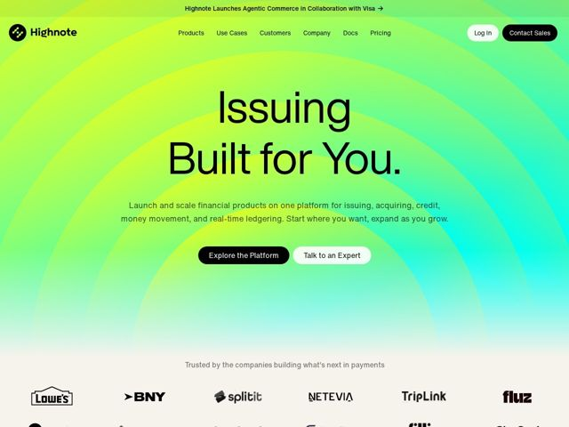

# Highnote — https://highnote.com

- **niche:** fintech
- **mood:** bold-loud
- **style:** gradient, colorful, mono-type
- **palette:** bg `#C6F23A` · ink `#0A0A0A` · accent `#16E0C8` — The accent is the gradient itself — lime bg sweeps into teal/cyan (#16E0C8) at the lower-right; black is used for ink, the primary CTA pill, and the Highnote logo mark
- **type:** display *Neue Haas Grotesk / Helvetica Now-style grotesque (geometric-leaning, very tight tracking, lining a/g)* · body *Same grotesque sans, regular weight* — Clean Swiss neo-grotesque, tightly set, confident and quiet — type stays neutral so the loud gradient does the shouting
- **sections:** hero › logos › feature-platform › feature-use-cases › feature-customers › how-it-works › cta › footer
- **signature:** The hero is a giant radial gradient of concentric rings — acid lime at center bleeding to cyan at the edges — that visualizes a literal "high note" / sound wave radiating outward, with pure-black headline type sitting directly on top (no card, no panel).
- **imagery:** No product screenshots above the fold — the hero IS a full-bleed gradient-mesh: concentric acid-lime-to-cyan rings radiating like sonar/sound waves (a literal "high note"). Below, mono-style monochrome partner logos on a near-white band.
- **copy:** Two-word manifesto headline stacked huge — "Issuing / Built for You." — declarative, confident, you-centric; subhead lists the platform breadth (issuing, acquiring, credit, money movement, real-time ledgering).

**Takeaways (steal as ideas, don't copy):**
- Pair a screaming, high-chroma gradient background with dead-neutral black grotesque type and zero decoration — the color carries all the energy, the typography stays disciplined.
- Make the gradient mean something: concentric sonar rings literally illustrate the brand name (Highnote = sound radiating), instead of a generic mesh blob.
- Set the hero headline as a 2-word vertical stack at near-display-cap size so it reads as a slogan/manifesto, then ground it with a one-line plain-language subhead listing the actual capabilities.
- Black pill CTA + ghost-outline secondary CTA on a vivid background — the solid-black button becomes the single highest-contrast object on the page, pulling the eye to 'Explore the Platform.'
