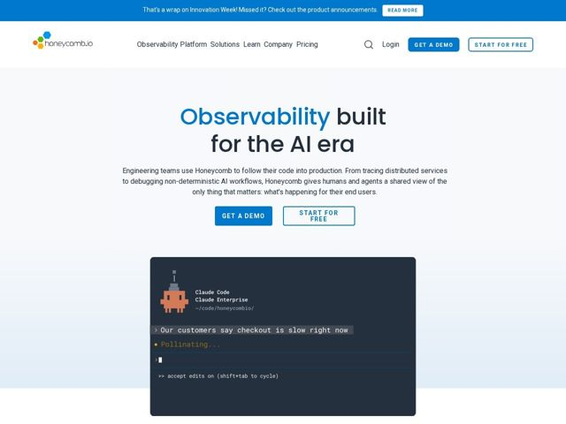

# Honeycomb — https://honeycomb.io

- **niche:** observability / dev-tools (developer infrastructure, APM)
- **mood:** clean-light
- **style:** minimal, mono-type, clean, illustrated
- **palette:** bg `#FFFFFF` · ink `#1A2B3C` · accent `#1B6FD4` — a palavra 'Observability' no título, o preenchimento do CTA principal (Get a Demo), a barra de anúncio do topo, os hexágonos do logo e os traços de link/botão-contorno
- **type:** display *Sans geométrica (estilo Poppins / Gilroy, peso pesado)* · body *Sans humanista neutra (system/tipo Inter)* — Amigável-mas-engenheirada: a display geométrica arredondada parece acessível e confiante, enquanto a sans calma do corpo a mantém credível para um comprador técnico. O painel de terminal monoespaçado adiciona uma textura nativa de desenvolvedor, mãos-no-teclado.
- **sections:** announcement-bar › hero › feature-terminal-demo › feature-built-for-answers › feature-what-it-helps-you-do › solutions-by-team › education-experts › learn-resources › cta › footer
- **signature:** O "screenshot" do hero é um terminal de agente de falsa-IA ao vivo onde um painel do Claude Code está literalmente consultando o Honeycomb — relatório de bug digitado, o status mostra um spinner com trocadilho da marca "Pollinating..." em vez de um mockup genérico de UI de produto. Dramatiza a depuração compartilhada humano+agente na própria voz do produto, em vez de mostrar dashboards.
- **imagery:** Nenhuma fotografia. Um único card de terminal escuro monoespaçado flutua sobre um suave gradiente cinza-frio, ancorado por um avatar de robô em pixel-art. A estética é leve em ilustração e nativa de código; a metáfora da abelha/colmeia (logo hexagonal, texto "Pollinating", ponto âmbar) carrega o calor da marca para dentro de um layout claro e por outro lado contido.
- **copy:** Título de cor dividida em dois tons que lidera com a palavra da categoria e finca o momento da era-IA; técnico mas falado de forma simples. Hero: "Observability built for the AI era" (acento em "Observability").

**Takeaways (roube como ideias, não copie):**
- Divida a cor do H1 do hero: renderize o substantivo da categoria em azul de acento e o restante no texto, para que a página declare sua categoria e seu ângulo num só olhar.
- Substitua o screenshot obrigatório de dashboard de produto por um terminal de agente falso que encena uma pergunta real de usuário ('Our customers say checkout is slow right now') — mostre o fluxo de trabalho, não o cromo da UI.
- Contrabandeie a metáfora da marca para dentro do micro-texto: um spinner de carregamento que diz 'Pollinating...' com um ponto âmbar transforma um estado do sistema em personalidade.
- Emparelhe dois CTAs como preenchido-vs-contorno (Get a Demo / Start for Free) para atender compradores enterprise e self-serve sem conflito de hierarquia visual.
