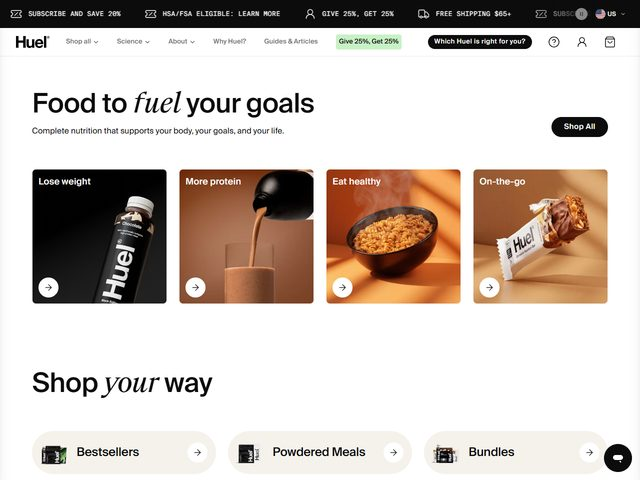

# Huel — https://huel.com

- **niche:** food
- **mood:** clean-light
- **style:** clean, photographic, editorial, grid
- **palette:** bg `#FFFFFF` · ink `#15110D` · accent `#C97B3C` — O terracota/âmbar quente não é uma cor de UI; ele vive quase inteiramente dentro da fotografia (fundos de saco de papel, a bebida de cacau, a tigela de cereal), de modo que a página se lê como uma moldura branca e limpa em torno de imagens de comida quentes. Um pequeno chip de indicação verde-lima `Give 25%, Get 25%` é o único acento de UI verdadeiro.
- **type:** display *sans quase-grotesca (com pegada de Aktiv Grotesk / Neue Haas Grotesk) misturada com uma serifa itálica contrastante (Tiempos / Canela itálico)* · body *sans humanista, cinza regular* — Confiante e editorial; a serifa itálica injeta calor numa sans de resto utilitária.
- **sections:** hero › goal-tiles (lose weight / more protein / eat healthy / on-the-go) › shop-your-way (bestsellers / powdered meals / bundles) › nutrition-science › reviews-ugc › sustainability › cta › footer
- **signature:** O hero substitui uma única imagem-herói por uma fileira de quatro goal-tiles iguais — cada um um card de foto quadrado com um chip de rótulo escuro e um botão circular `→` (Lose weight sobre preto, More protein sobre uma despejada de cacau, Eat healthy sobre uma tigela fumegante, On-the-go sobre uma barra Huel). Transforma a dobra num menu auto-segmentador: você clica no seu objetivo, não num produto. O título misto de sans/serifa-itálica (`Food to *fuel* your goals`) é o movimento tipográfico de assinatura da marca, repetido em `Shop *your* way` abaixo.
- **imagery:** Fotografia de produto de estúdio em high-key sobre fundos quentes de saco de papel — comida real encenada com movimento (cacau em meio à despejada, vapor subindo da tigela) em vez de packshots em flat-lay. Garrafas e barras fotografadas como objetos-herói com sombras suaves. Nada de 3D, nada de ilustração; o calor vem inteiramente da iluminação e da superfície.
- **copy:** Simples, objetivo-primeiro, orientado a benefício. Título `Food to fuel your goals` (a palavra `fuel` composta numa serifa itálica), subtítulo `Complete nutrition that supports your body, your goals, and your life.` Pílula de CTA `Shop All`; prompt de nav `Which Huel is right for you?`; os rótulos dos tiles se leem como resultados — `Lose weight`, `More protein`, `Eat healthy`, `On-the-go`.

**Takeaways (roube como ideias, não copie):**
- Substitua a única imagem-herói por uma fileira de tiles de objetivo/resultado para que o visitante se auto-segmente por intenção logo no primeiro scroll.
- Mantenha o canvas branco puro e deixe a cor quente viver apenas dentro da fotografia — a comida vira a paleta.
- Misture uma única serifa itálica de contraste num título grotesco sobre uma única palavra enfatizada (`fuel`, `your`) para adicionar voz sem um segundo sistema de tipografia em todo lugar.
- Encene as fotos de produto com movimento implícito (uma despejada, vapor subindo) em vez de packshots estáticos para fazer uma grade limpa parecer apetitosa e viva.
