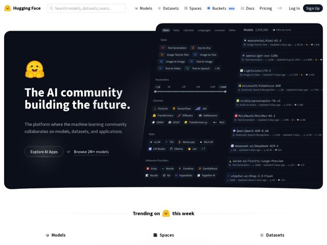

# Huggingface — https://huggingface.co

- **niche:** ai
- **mood:** technical-dark
- **style:** dark, mono-type, minimal
- **palette:** bg `#FFFFFF` · ink `#1B1B1D` · accent `#FFD21E` — o símbolo da marca emoji de carinha-abraço (logo, glifo do hero, o 'Trending on 🤗 this week' inline), mais micro-ícones quentes de chama amarelo/laranja e de coração espalhados pelo painel de listagem de modelos
- **type:** display *Source Sans Pro (peso heavy/black, tracking bem apertado)* · body *Source Sans Pro regular; IBM Plex Mono para rótulos de UI de código/nome-de-modelo* — Engenharia-amigável: uma sans humanista robusta para calor no título, emparelhada com uma monospace que sinaliza 'esta é uma ferramenta para builders' em cada chip e nome de repositório.
- **sections:** hero › feature-models › feature-spaces › feature-datasets › feature-platform › how-it-works › logos › feature-open-source › feature-enterprise › feature-inference › feature-compute › cta › footer
- **signature:** O hero não é um mockup de marketing polido — é uma fatia inclinada e com cara de ao-vivo da UI real do produto (o navegador de modelos de verdade, com chips de filtro, slider de parâmetro e um feed de repositórios rolando) sangrando pela borda direita. Vende a plataforma mostrando a própria ferramenta densa e funcional em vez de uma ilustração abstrata.
- **imagery:** Nenhuma fotografia de banco de imagens ou renders 3D. As imagens = a própria interface densa do produto renderizada como um painel escuro de cantos arredondados, sobreposta com pequenos logos coloridos de framework/provedor (PyTorch, JAX, Groq, Cerebras) como chips com pendor monocromático. O único glifo de emoji carrega toda a personalidade da marca contra uma estética de resto clínica, de grade-de-dados.
- **copy:** Declarativo simples, de grau-missão — discretamente ambicioso, sem palavras de hype. Hero: "The AI community building the future." sub: "The platform where the machine learning community collaborates on models, datasets, and applications."

**Takeaways (roube como ideias, não copie):**
- Use uma fatia real e levemente inclinada do seu produto ao vivo como arte do hero e deixe-a sangrar pela borda do canvas — densidade se lê como credibilidade para um público de builders.
- Deixe UM glifo de marca saturado (aqui o emoji amarelo) fazer todo o trabalho de calor numa página de resto austera e monocromática, reutilizando-o até inline dentro de títulos de seção ('Trending on 🤗 this week').
- Emparelhe uma display sans humanista pesada com uma fonte de UI monospace para que a página pareça ao mesmo tempo humana e engenheirada — mono em chips/nomes-de-repo sinaliza 'ferramenta', sans no título sinaliza 'comunidade'.
- CTAs gêmeos como 'botão primário OU link de texto simples' ('Explore AI Apps  or  Browse 2M+ models') — o caminho secundário acumula a função de uma estatística viva de prova-de-escala.
