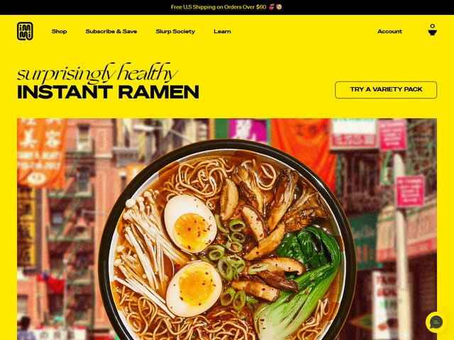

# immi — https://www.immieats.com

- **niche:** food
- **mood:** bold-loud
- **style:** photographic, saturated, retro-pop, appetite-forward
- **palette:** bg `#FFD400` · ink `#161616` · accent `#E8541E` — A single saturated marigold yellow floods the entire fold edge to edge; the orange-red only appears organically inside the food photo (the broth, the chili oil) and in the top promo bar emoji, so the "accent" is the food itself rather than a UI color.
- **type:** display *mixed pairing — a connected English-roundhand script ("surprisingly healthy") set against a heavy condensed grotesque ("INSTANT RAMEN", think Druk / Acumin Condensed Black)* · body *clean geometric sans (Aktiv Grotesk / Inter) for nav and the promo bar* — Playful but confident; the script whispers the qualifier, the slab-bold caps shout the product.
- **sections:** hero › benefits-nutrition-stats › flavors-grid › how-it-works › slurp-society-community › reviews › subscribe-cta › footer
- **signature:** The whole hero is built on a near-fluorescent taxi-yellow with ZERO gradient or texture, then anchored by one enormous top-down photograph of a ramen bowl shot against a real Chinatown street scene (red lanterns, hand-painted shop signage) bleeding behind it. The two-tier headline does the heavy lifting: a flirty cursive "surprisingly healthy" sits directly on top of brick-heavy condensed caps "INSTANT RAMEN", a deliberate high/low type collision that makes the health claim feel handwritten-honest and the product name feel loud and packaged.
- **imagery:** Photographic, single dominant hero image — an overhead hero shot of the finished bowl (jammy soft egg halves, enoki, bok choy, mushrooms, scallions) composited over a saturated street-food backdrop. No 3D, no illustration; the only graphic element is the tiny boxed "immi" wordmark logo. Warm, high-saturation, food-magazine grade.
- **copy:** Cheeky DTC voice that leads with the contradiction — script line **"surprisingly healthy"** stacked over caps **"INSTANT RAMEN"**, with a promo eyebrow **"Free U.S Shipping on Orders Over $60"** and a single outlined pill CTA **"TRY A VARIETY PACK"**. Nav names are branded ("Slurp Society", "Subscribe & Save") rather than generic.

**Takeaways (steal as ideas, don't copy):**
- Flood the entire fold with one unapologetic saturated brand color (no gradient, no texture) and let a single appetizing photo be the only other element.
- Collide two type registers in one headline — a flirty script for the qualifier on top of heavy condensed caps for the product — so a health claim reads honest and the product reads loud.
- Shoot the product over a real-world cultural backdrop (Chinatown street, lanterns, signage) instead of a clean studio sweep, so the photo carries place and story, not just the food.
- Brand the nav itself ("Slurp Society", "Subscribe & Save") to turn a utility menu into voice, and keep the CTA a quiet outlined pill so the food, not the button, is the hero.
