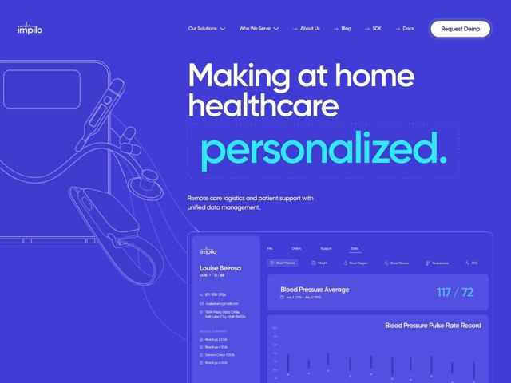

# Impilo — https://impilo.health

- **niche:** healthtech (remote patient monitoring / digital health API infra)
- **mood:** bold-loud
- **style:** bold, colorful, dark, illustrated
- **palette:** bg `#4338E0` · ink `#FFFFFF` · accent `#3EE0F0` — the single emphasized word 'personalized.' in the headline, plus dashboard metric values (BP '117/72') and chart data points
- **type:** display *Gilroy (geometric sans, heavy/black weight, rounded terminals)* · body *Gilroy (regular weight)* — Friendly-confident: rounded geometric letterforms at massive scale read warm and human rather than clinical, softening a B2B medical-infra pitch
- **sections:** hero › feature-product-dashboard › logos › feature-grid › how-it-works › cta › footer
- **signature:** Drenching an entire healthcare page in saturated electric indigo instead of the obligatory sterile white/teal-on-white — then making the hero a single giant word ('personalized.') set inside a dotted-outline 'fill-in-the-blank' box, as if the brand promise is being handwritten into a form.
- **imagery:** Wireframe line-art of medical devices (BP cuff, stethoscope, tablet) ghosted at low opacity into the left bleed as ambient outline illustration; the right side anchors a realistic product UI mockup of the patient-monitoring dashboard (patient card, vitals tabs, BP chart) for credibility.
- **copy:** Plain-spoken benefit framing with one emphasized payoff word — hero reads 'Making at home healthcare personalized.' over the subhead 'Remote care logistics and patient support with unified data management.'

**Takeaways (steal as ideas, don't copy):**
- Pick one ownable saturated brand color and flood the whole canvas with it — committing to monochrome indigo makes a single cyan accent word detonate.
- Use a dotted-outline 'blank field' container around the key word so the headline feels like a form being completed — turns a static tagline into an interactive-feeling fill-in.
- Pair ghosted low-opacity line-art of your physical product (device wireframes) with a high-fidelity UI mockup: poetry on one side, proof on the other.
- Let display type go genuinely huge and heavy in a rounded geometric sans (Gilroy) to make a clinical/B2B category feel human and approachable.
