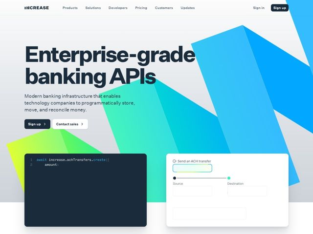

# Increase — https://increase.com

- **niche:** fintech (banking infrastructure / financial APIs)
- **mood:** technical-dark
- **style:** gradient, bold, mono-type, colorful
- **palette:** bg `#FFFFFF` · ink `#1A2330` · accent `#16E0A0` — the dominant move is a giant prismatic gradient sheet (lime-yellow to emerald to cyan to electric blue) slicing diagonally across the right two-thirds of the hero; teal also tints the code-card focus ring and the source/destination connector dots
- **type:** display *Helvetica Neue / Inter-style grotesque, ultra-bold, extremely tight tracking* · body *same neutral grotesque at regular weight* — Swiss banker-meets-engineer: heavyweight, no-nonsense, the spaced-out 'INCREASE' wordmark and tight headline signal precision and institutional weight
- **sections:** hero › feature-code-demo › feature-interactive-widget
- **signature:** A literal prism of light: instead of fintech's usual flat navy + single-blue palette, the entire hero is dominated by a sharp-edged, full-spectrum gradient shard (lime to cyan) angled like a beam of refracted light cutting through the page — banking rendered as something luminous and alive rather than safe and corporate.
- **imagery:** No photography or illustration. Two functional UI artifacts float over the gradient: a dark terminal card showing real API code (await increase.achTransfers.create) and a white 'Send an ACH transfer' form widget with an animated source-to-destination progress track. The product literally demos itself; the geometric color-sheet is the only decorative element.
- **copy:** Confident, plain-spoken engineering register — names the audience and the verbs directly. Hero: "Enterprise-grade banking APIs" / sub: "Modern banking infrastructure that enables technology companies to programmatically store, move, and reconcile money."

**Takeaways (steal as ideas, don't copy):**
- Pair a near-monochrome ink-on-white layout with ONE oversized, hard-edged spectral gradient shard — let that single beam carry all the color so the type stays severe and serious.
- Make the hero prove the product: a real code snippet beside a working-looking interactive form (with an animated transfer track) beats any stock graphic for a developer/infra audience.
- Use spaced-out, letter-spaced uppercase for the wordmark against a tightly-tracked ultra-bold headline — the tension between airy logo and dense headline reads as precision.
- Dual CTA hierarchy done right: solid dark 'Sign up' for self-serve devs, outlined 'Contact sales' for enterprise — both with a chevron to imply forward motion.
